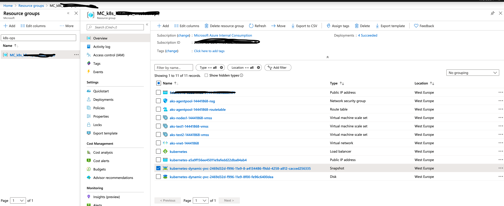

# Backup and Restore AKS
Backup and Restore should be the top item in your business continuity plan. in this demo i'll walk you through the different options you have in Azure and the recommendations.

## Why is this important?
The need for back up and restore is concerned when state is involved in your Kubernetes deployment, once you have a persistent volume as part of a Kubernetes stateful set or a deployment then your cluster is no longer the same, it requires more care, as losing the cluster or the volume will result in losing data.

## Azure Snapshot API
This section is focused on the Azure Disk snapshots, if you're using Azure File then the process is much easier, you can create a share snapshot as documented [here](https://docs.microsoft.com/en-us/azure/storage/files/storage-snapshots-files), then remount in case of any sort of failure.

AKS docs has the process of how you can backup and restore Azure Disks, which can be found [here](https://docs.microsoft.com/en-us/azure/aks/azure-disks-dynamic-pv#back-up-a-persistent-volume),if you went through the article you will notice the below limitations:
* Azure Snapshot API isn't Kubernetes native 
* There are no means of tracking which persistent volume belongs to which deployment, statefulset, namespace, etc...
* you will need to script your way through to have proper mapping

If you're ok with the above limitations, then Azure Snapshot API is what you should use, if not then we need to find a more native solution to satisfy your backup and restore needs, we will cover this in the coming section.

*Note* Azure Backup team is busy working on a native solution.


## ARK/Velero 
[Velero](https://velero.io/docs/master/index.html) (Formerly Heptio ARK), is a Kubernetes native Backup and Restore tool for your persistent volumes. 

Installing Velero on AKS is pretty straightforward, follow the document [here](https://velero.io/docs/v1.1.0/azure-config/) and you will be up and running with Velero in under 30 mnts. 


After completing the installation, you will have local velero client, Azure Blob Storage account to ship all the metadata to, and your snapshots will be stored in your AKS Infrastrucre (MC_) Resource Group.

#### The Demo
We will create a Namespace, deploy a MySQL database and write some records to it, backup the namespace using Velero, then delete the namespace to simulate failure. Finally, try to restore, all goes well, our DB should be restored along with its last know state.

###### 1- Make sure Velero is running:
```shell
$ kubectl get pods -n velero
NAME                      READY   STATUS    RESTARTS   AGE
velero-78d99d758b-qq8tk   1/1     Running   0          33d
```

###### 2- Verify your local client
```shell
$ velero version
Client:
        Version: v1.0.0
        Git commit: 72f5cadc3a865019ab9dc043d4952c9bfd5f2ecb
Server:
        Version: v1.0.0
```

###### 3- Create a namespace 
```shell
$ kubectl create namespace ignite
namespace/ignite created
```

###### 4- Create your mysql database, this process will take some minutes in order to create the azure disk and attach it to your node
```shell
kubectl apply -f mysql-configmap.yaml
kubectl apply -f mysql-services.yaml
kubectl apply -f mysql-statefulset.yaml
kubectl get pods -l app=mysql -n ignite --watch
```

###### 5- Create a Pod from the mysql image which will act as our client/front end, the pod will craete a database called "igintedb" and insert a record in it
```shell
kubectl -n ignite run mysql-client --image=mysql:5.7 -i --rm --restart=Never --\
  mysql -h mysql-0.mysql <<EOF
CREATE DATABASE ignitedb;
CREATE TABLE ignitedb.messages (message VARCHAR(250));
INSERT INTO ignitedb.messages VALUES ('Hello Ignite');
EOF
```

###### 6- Ensure the record got written
```shell
$ kubectl -n ignite run mysql-client --image=mysql:5.7 -i -t --rm --restart=Never --\
  mysql -h mysql -e "SELECT * FROM ignitedb.messages"
+--------------+
| message      |
+--------------+
| Hello Ignite |
+--------------+
pod "mysql-client" deleted
```

###### 7- Backup your namespace
```shell
$ velero backup create ignite-v1 --include-namespaces ignite
Backup request "ignite-v1" submitted successfully.
Run `velero backup describe ignite-v1` or `velero backup logs ignite-v1` for more details.
$ velero backup describe ignite-v1
Name:         ignite-v1
Namespace:    velero
Labels:       velero.io/storage-location=default
Annotations:  <none>

Phase:  Completed

Namespaces:
  Included:  ignite
....
```

###### 8- Check your storage account for your backup


###### 9- Find the disk snapshot under your Infrastructure resource group MC_



###### 10- Now that we have a valid backup, proceed with deleting your namespace to simulate failure
```shell
$ kubectl delete namespaces ignite
namespace "ignite" deleted
$ kubectl get namespace ignite
Error from server (NotFound): namespaces "ignite" not found
```

###### 11- Restore your snapshot 
```shell
$ velero restore create --from-backup ignite-v1
Restore request "ignite-v1-20191028172722" submitted successfully.
Run `velero restore describe ignite-v1-20191028172722` or `velero restore logs ignite-v1-20191028172722` for more details.

$ velero restore describe ignite-v1-20191028172722
Name:         ignite-v1-20191028172722
Namespace:    velero
Labels:       <none>
Annotations:  <none>

Phase:  Completed

Backup:  ignite-v1
....
``` 

###### 12- Now check your namespace, the process will take some minutes as well, as we are creating the MySQL statefulset and creatting and attaching the disk to the node
```shell
$ kubectl get pods -n ignite
NAME      READY   STATUS    RESTARTS   AGE
mysql-0   2/2     Running   0          2m32s
```

###### 13- Now that the databse got restored, lets try to retrieve our record 
```shell
$ kubectl -n ignite run mysql-client --image=mysql:5.7 -i -t --rm --restart=Never --\
  mysql -h mysql -e "SELECT * FROM ignitedb.messages"
+--------------+
| message      |
+--------------+
| Hello Ignite |
+--------------+
pod "mysql-client" deleted
```

Our demo is concluded


#### Important Note
The other important part of your business continuity  plan is to ship your snapshots and disks to another region
1. Azure Blob Storage  and blob containers can be easily geo replicated check [here](https://docs.microsoft.com/en-us/azure/storage/common/storage-redundancy)
2. The other remaining part is copying the actual disk snapshot to another region, unfortunately as it stands we don't have a native API to accomplish this, however, there is a Power Shell module which can accomplish this you can find it [here](https://docs.microsoft.com/en-us/azure/virtual-machines/scripts/virtual-machines-windows-powershell-sample-copy-snapshot-to-storage-account), also please add your use case to the user voice [here](https://feedback.azure.com/forums/216843-virtual-machines/suggestions/34900495-should-be-able-to-copy-snapshots-between-regions-i) 


**Note that the backup team is already working on the above capability, if you are interested in influcening how a first party solution  would  work, then please  fill  the below survey **


