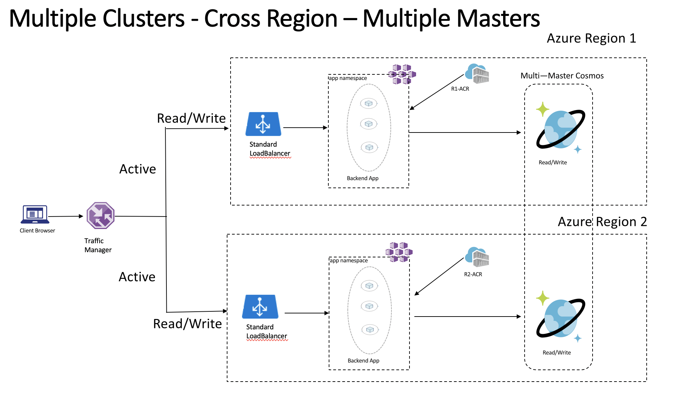
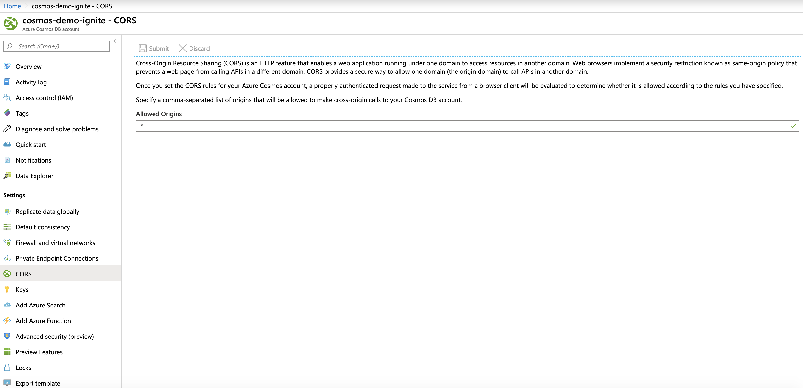
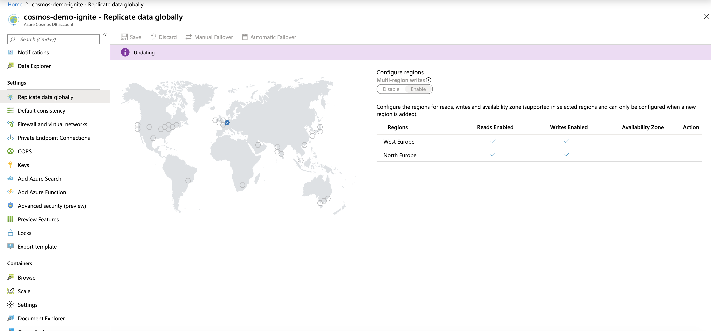
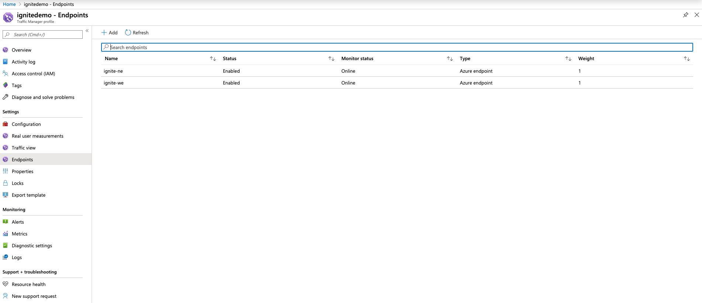

## AKS Multi Region Setup With Azure Cosmos DB

Some of the applications in your organization may require active/active cross region setup, and for this to work you will require a database engine which can support this, in Azure Cosmos DB has a cross region multiple master feature that can help us accomplish this requirement. 

The application for this demo is about uploading and viewing cats images from Cosmos DB across 2 regions.

Also we will be using [Azure Traffic Manager](https://docs.microsoft.com/en-us/azure/traffic-manager/traffic-manager-overview) to have a single read/write endpoint for both regions. 

This is how our application will look like


###### Special thanks 
Thanks to my colleague Rasmus Hummelmose who helped in writing the application code for this demo, the work can be found here https://github.com/rhummelmose/cosmocats.


## the demo

1. Spin up 2 AKS clusters in 2 different regions 
```shell
#our primary cluster
#define the variables
location=westeurope
rg=aks-ignite-we
clustername=aks-iginte-we
vmsize=Standard_B2s
nodecount=2

#create the resource group
az group create --name $rg --location $location

#create the clsuter 
 az aks create --resource-group $rg \
    --name $clustername \
    --location $location \
    --generate-ssh-keys \
    --node-count $nodecount \
    --node-vm-size $vmsize \
    --no-wait

#get the credintials 
$ az aks get-credentials -n $clustername -g $rg

#our remote/secondary cluster
#define the variables
rlocation=northeurope
rrg=aks-ignite-ne
rclustername=aks-iginte-ne
vmsize=Standard_B2s
nodecount=2

#create the resource group
az group create --name $rrg --location $rlocation

#create the clsuter 
 az aks create --resource-group $rrg \
    --name $rclustername \
    --location $rlocation \
    --generate-ssh-keys \
    --node-count $nodecount \
    --node-vm-size $vmsize \
    --no-wait

#get the credintials
az aks get-credentials -n $rclustername -g $rrg
```

2. Create an Azure Cosmos DB using SQL API and enable multi region writes. pretty straight forward.

* enable CORS in your Cosmos DB


* add another region to your cosmos DB


3. deploy your application 
The application is a simple node application, which uploads cats and view them from Cosmos.

We have 2 files app_regionp[1,2].yaml, each one is supposed to be deployed to a different region, and you **should modify the Cosmos Connection parameters in each of them.**

###### Note
I used Environment Variables inside my pod manifest for demo purposes only, in production you should be using a Key Vault or K8s secrets to store such parameters.

I'll be using a tool called kubectx to switch between clusters, if you never used it before then stop everything you're doing and go and install it from [here](https://github.com/ahmetb/kubectx).

```shell
#switch context to the first cluster
kubectx $clustername

#deploy  and expose the application using type loadbalancer 
$ kubectl apply -f app_region1.yaml
$ kubectl expose pod cosmoscats-west --type=LoadBalancer --port 80

#make sure your container is running and you have got a Public IP
$ kubectl get pods cosmoscats-west
NAME              READY   STATUS    RESTARTS   AGE
cosmoscats-west   1/1     Running   0          4h20m

$ kubectl get svc cosmoscats-west
NAME              TYPE           CLUSTER-IP   EXTERNAL-IP     PORT(S)        AGE
cosmoscats-west   LoadBalancer   10.0.85.80   52.XXX.XXX.XXX   80:30884/TCP   4h19m

*head to your browser and type* http://EXTERNAL-IP-Value click on add if you see a cat then things are working fine

#repeat the exact same for the second cluster, and remeber you have to change the values in the app_regoin2.yaml 

#switch context to the first cluster
kubectx $rclustername

#deploy  and expose the application using type loadbalancer 
$ kubectl apply -f app_region2.yaml
$ kubectl expose pod cosmoscats-north --type=LoadBalancer --port 80

#make sure your container is running and you have got a Public IP
$ kubectl get pods cosmoscats-north
NAME               READY   STATUS    RESTARTS   AGE
cosmoscats-north   1/1     Running   0          3h52m

$ kubectl get svc cosmoscats-north
NAME               TYPE           CLUSTER-IP    EXTERNAL-IP     PORT(S)        AGE
cosmoscats-north   LoadBalancer   10.0.197.59   52.155.178.26   80:32179/TCP   3h52m

#test again, http://EXTERNAL-IP, all goes well, proceed. 
```

4. Create a traffic manager profile

Now that we have 2 endpoints for our application lets use Azure Traffic Manager to load balance across them. 

Creating a traffic manager should be straight forward, head to the [docs](https://docs.microsoft.com/en-us/azure/traffic-manager/traffic-manager-configure-weighted-routing-method) and follow along, but note the below:
* You can choose any routing method, in my case I chose "Weighted" to Round Rubin across the endpoints
* Your endpoint type will be IP Address
* You won't find your IPs in the endpoint selection unless you created DNS names for them before, so head to your MC_ resource group -> find your IP -> configure -> create DNS name -> save. repeated for the second cluster.


You should end up with something similar to the below
Configuration


Endpoints


5. Find the DNS name for your traffic manager profile (located in the overview section) and test, this concludes our demo!


#### Important Notes
1. I used docker hub for my application image, as Azure Container Registry can't be public
2. In production you're highly  advised to make use of Azure Container Registry, which has features like geo-replication which should help you to ship your images to a remote region
3. The above was just for demo purposes and was created in a rush, don't use the same in production, please follow the best practices in production 

