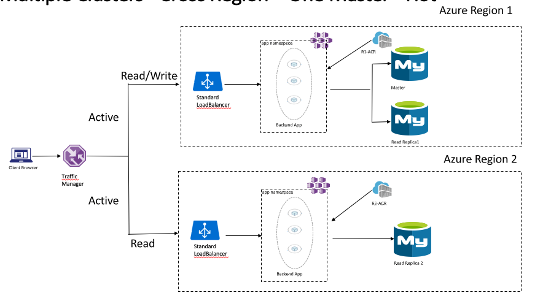
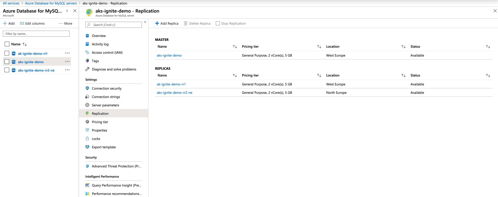
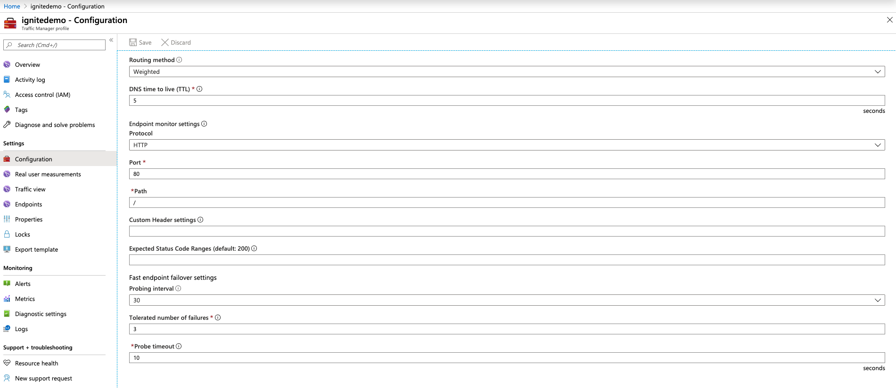

## AKS Multi Region Setup With Azure MySQL
Fact is Kubernetes Statefulsets don't span clusters, which means your MySQL running inside one K8s cluster won't be able to replicate out of the box to another cluster unless you wan't to create some custom logic, which will be messy, also its not fun to manage databases so long there is a managed option available for you.

In this demo, we will externalize our state using [Azure MySQL](https://docs.microsoft.com/en-us/azure/mysql/) which supports read replicas [in regions](https://docs.microsoft.com/en-us/azure/mysql/howto-read-replicas-portal) and [across regions](https://docs.microsoft.com/en-us/azure/mysql/concepts-read-replicas#cross-region-replication)

We will use a simple application which reads records from the database and print its hostname to reflict which regions its in.

Also we will be using [Azure Traffic Manager](https://docs.microsoft.com/en-us/azure/traffic-manager/traffic-manager-overview) to have a single read endpoint for both regions. 

This is how our application will look like


## Do you really need Multi-region
Before we go on with the demo, I need to stress the fact that multi-region is such a hard task especially if state is involved, and more so, if the state is reliant of a relational database, then having multi-master that spans regions is almost non-existent for most of the DB engines out there. 

Now, you could argue that all Azure regions have AZs in them, so you should invest in multi-region. I agree, but you need to have reasonable expectations i.e. active/active (read/write) multi-region setup with a relational database is almost impossible with most of the OSS DB engines out there. active/passive is fully achievable nonetheless and is a good option. 

always weigh in the risk vs effor in whatever you're trying to achieve.


## the demo

1. Spin up 2 AKS clusters in 2 different regions 
```shell
#our primary cluster
#define the variables
location=westeurope
rg=aks-ignite-we
clustername=aks-iginte-we
vmsize=Standard_B2s
nodecount=2

#create the resource group
az group create --name $rg --location $location

#create the clsuter 
 az aks create --resource-group $rg \
    --name $clustername \
    --location $location \
    --generate-ssh-keys \
    --node-count $nodecount \
    --node-vm-size $vmsize \
    --no-wait

#get the credintials 
$ az aks get-credentials -n $clustername -g $rg

#our remote/secondary cluster
#define the variables
rlocation=northeurope
rrg=aks-ignite-ne
rclustername=aks-iginte-ne
vmsize=Standard_B2s
nodecount=2

#create the resource group
az group create --name $rrg --location $rlocation

#create the clsuter 
 az aks create --resource-group $rrg \
    --name $rclustername \
    --location $rlocation \
    --generate-ssh-keys \
    --node-count $nodecount \
    --node-vm-size $vmsize \
    --no-wait

#get the credintials
az aks get-credentials -n $rclustername -g $rrg
```

2. Spin up an Azure MySQL DB and create  one local read replica and one cross region read replica, follow the docs to achieve this which should be pretty straight forward [here](https://docs.microsoft.com/en-us/azure/mysql/quickstart-create-mysql-server-database-using-azure-portal) and [here](https://docs.microsoft.com/en-us/azure/mysql/howto-read-replicas-portal).

We should end up with a setup similar to the below


3. connect to your main Azure Mysql instance and create a database with some records 

```shell

mysql -h YOUR_MAIN_INSTANCE_NAME.mysql.database.azure.com -u USERNAME@YOUR_MAIN_INSTANCE_NAME -p

#create a database, create a table and insert a record 
> CREATE DATABASE ignite;
> USE ignite;
> CREATE TABLE messages (name varchar(20));
> INSERT INTO messages values ("Hello MSIgnite!");
> exit;
```

4. Deploy the application 

The application is a simple (single page) PHP application, which reads the messages from the Database, print the Pod Hostname, and the Node Hostname as well.

We have 2 files app_regionp[1,2].yaml, each one is supposed to be deployed to a different region, and you should modify the database connection parameters in each of them.

###### Note
I used Environment Variables inside my pod manifest for demo purposes only, in production you should be using a Key Vault or K8s secrets to store such parameters.


I'll be using a tool called kubectx to switch between clusters, if you never used it before then stop everything you're doing and go and install it from [here](https://github.com/ahmetb/kubectx).

```shell
#switch context to the first cluster
kubectx $clustername

#deploy  and expose the application using type loadbalancer 
$ kubectl apply -f app/app_region1.yaml
$ kubectl expose pod php-westeurope --type=LoadBalancer --port 80

#make sure your container is running and you have got a Public IP
$ kubectl get pods -l location=westeurope
NAME             READY   STATUS    RESTARTS   AGE
php-westeurope   1/1     Running   0          23m

$ kubectl get svc php-westeurope
NAME             TYPE           CLUSTER-IP    EXTERNAL-IP      PORT(S)        AGE
php-westeurope   LoadBalancer   10.0.13.198   51.XXX.XXX.XXX   80:30310/TCP   23m

*head to your browser and type* http://EXTERNAL-IP-Value if you see data then things are working fine.

#repeat the exact same for the second cluster, and remeber you have to change the values in the app_regoin2.yaml 

#switch context to the first cluster
kubectx $rclustername

#deploy  and expose the application using type loadbalancer 
$ kubectl apply -f app/app_region2.yaml
$ kubectl expose pod php-northeurope --type=LoadBalancer --port 80

#make sure your container is running and you have got a Public IP
$ kubectl get pods -l location=northeurope
NAME              READY   STATUS    RESTARTS   AGE
php-northeurope   1/1     Running   0          39s

$ kubectl get svc php-westeurope
NAME              TYPE           CLUSTER-IP    EXTERNAL-IP      PORT(S)        AGE
php-northeurope   LoadBalancer   10.0.171.160   52.XXX.XXX.XXX   80:32214/TCP   46m

#test again, http://EXTERNAL-IP, all goes well, proceed. 
```

5. Create a traffic manager profile

Now that we have 2 read endpoints for our application lets use Azure Traffic Manager to load balance across them. 

Creating a traffic manager should be straight forward, head to the [docs](https://docs.microsoft.com/en-us/azure/traffic-manager/traffic-manager-configure-weighted-routing-method) and follow along, but note the below:
* You can choose any routing method, in my case I chose "Weighted" to Round Rubin across the endpoints
* Your endpoint type will be IP Address
* You won't find your IPs in the endpoint selection unless you created DNS names for them before, so head to your MC_ resource group -> find your IP -> configure -> create DNS name -> save. repeated for the second cluster.


You should end up with something similar to the below
Configuration


Endpoints


6. Find the DNS name for your traffic manager profile (located in the overview section) and test, this concludes our demo!


#### Important Notes
1. I used docker hub for my application image, as Azure Container Registry can't be public
2. In production you're highly  advised to make use of Azure Container Registry, which has features like geo-replication which should help you to ship your images to a remote region
3. Relational databases are just a pain when it comes to multi-region deployment, try to avoid it as much as you can, if you can't then have the reasonable expectations 
4. The above was just for demo purposes and was created in a rush, don't use the same in production, please follow the best practices in production 

