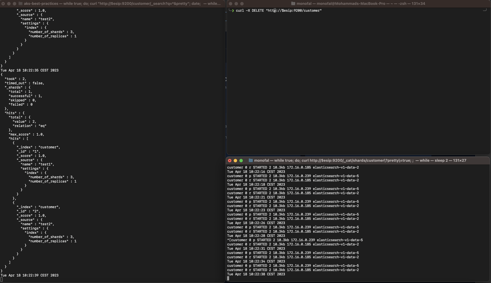
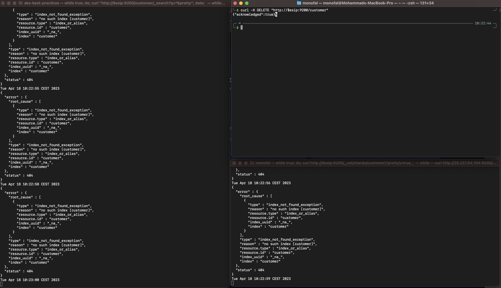
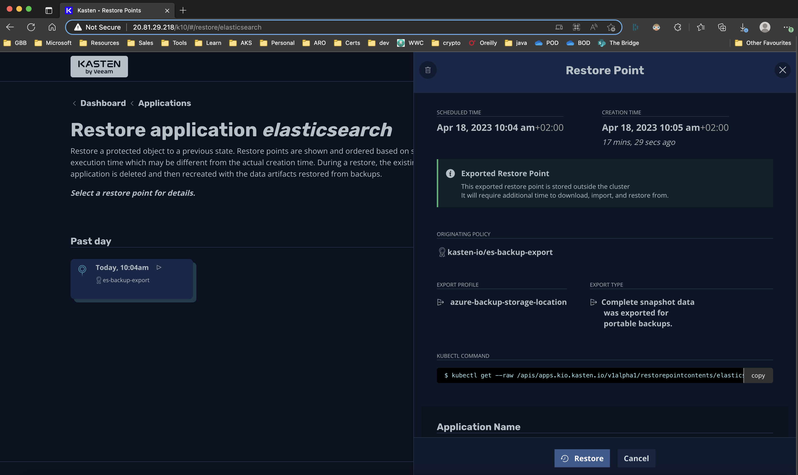
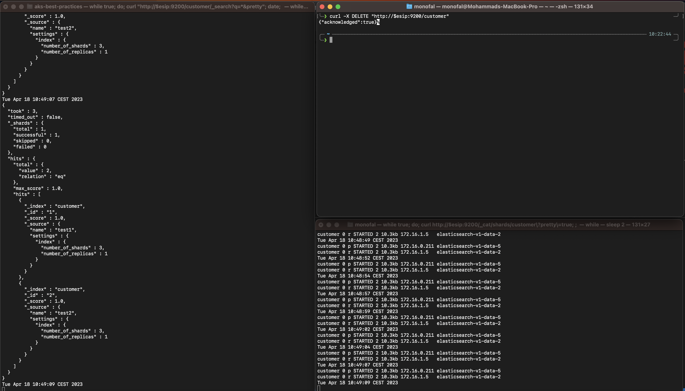

# Introduction

*Slides* can be found [here](https://github.com/mohmdnofal/aks-best-practices/blob/master/lux_k8s_stateful_workloads/slides/building_resilient_stateful_apps_k8s_100123.pdf)

*Note* This walkthrough been updated based on the latest work done by my colleague Steve Griffith [here](https://github.com/swgriffith/azure-guides/tree/master/aks-kasten)

We will start by creating a cluster, the cluster will be spun up as below:
1. The cluster will have uptime SLA enabled, to ensure master components are spread across availability zones (AZs)
2. System Node Pool: system node pool has no state in it, as such we will create a single pool with 3 nodes spread across 3 availability zones 
3. User Node Pools: this is where our application will be hosted, we will create 3 node pools with 2 nodes each which will be spread across 3 AZs 
4. Taint user node pools to ensure nothing else land in the pool but our application
5. Auto Scaling will be enabled in each node pool
6. Networking model: Kubenet or CNI don't make a difference here, we will use CNI to ensure max network performance for pods 
7. We will be using ephemeral disks for the nodes operating system 
8. We will be using managed identities 
9. Enable monitoring on the cluster
10. For sake of simplicity we won't be integrating with Azure AD

Here is how the cluster will look like 


# Cluster Create 

```bash
LOCATION=eastus # Location 
AKS_NAME=aks-kasten
RG=$AKS_NAME-$LOCATION
AKS_VNET_NAME=$AKS_NAME-vnet # The VNET where AKS will reside
AKS_CLUSTER_NAME=$AKS_NAME-cluster # name of the cluster
AKS_VNET_CIDR=172.16.0.0/16
AKS_NODES_SUBNET_NAME=$AKS_NAME-subnet # the AKS nodes subnet
AKS_NODES_SUBNET_PREFIX=172.16.0.0/23
SERVICE_CIDR=10.0.0.0/16
DNS_IP=10.0.0.10
NETWORK_PLUGIN=azure # use Azure CNI 
SYSTEM_NODE_COUNT=3  # system node pool size (single pool with 3 nodes across AZs)
USER_NODE_COUNT=2 # 3 node pools with 2 nodes each 
NODES_SKU=Standard_D4ds_v5 # node VM type 
K8S_VERSION=$(az aks get-versions  -l $LOCATION --query 'orchestrators[-1].orchestratorVersion' -o tsv)
SYSTEM_POOL_NAME=systempool
STORAGE_POOL_ZONE1_NAME=espoolz1
STORAGE_POOL_ZONE2_NAME=espoolz2
STORAGE_POOL_ZONE3_NAME=espoolz3
IDENTITY_NAME=$AKS_NAME`date +"%d%m%y"`
```

### Create the resource group
```bash
az group create --name $RG --location $LOCATION
```

### create identity for the cluster 
We're going to reuse the cluster identity created below for simplicity, but in a real world scneario you may prefer to maintain separate identities.

```bash
az identity create --name $IDENTITY_NAME --resource-group $RG
```

### get the identity id and clientid, we will use them later 
```bash
IDENTITY_ID=$(az identity show --name $IDENTITY_NAME --resource-group $RG --query id -o tsv)
IDENTITY_CLIENT_ID=$(az identity show --name $IDENTITY_NAME --resource-group $RG --query clientId -o tsv)
```

### Create the VNET and Subnet 
```bash
az network vnet create \
  --name $AKS_VNET_NAME \
  --resource-group $RG \
  --location $LOCATION \
  --address-prefix $AKS_VNET_CIDR \
  --subnet-name $AKS_NODES_SUBNET_NAME \
  --subnet-prefix $AKS_NODES_SUBNET_PREFIX
```

### get the RG, VNET, and Subnet IDs
RG_ID=$(az group show -n $RG  --query id -o tsv)
VNETID=$(az network vnet show -g $RG --name $AKS_VNET_NAME --query id -o tsv)
AKS_VNET_SUBNET_ID=$(az network vnet subnet show --name $AKS_NODES_SUBNET_NAME -g $RG --vnet-name $AKS_VNET_NAME --query "id" -o tsv)

### Assign the managed identity permissions on the RG and VNET
> *NOTE:* For the purposes of this demo we are setting the rights as highly unrestricted. You will want to set the rights below to meet your security needs.
```bash
az role assignment create --assignee $IDENTITY_CLIENT_ID --scope $RG_ID --role Contributor
az role assignment create --assignee $IDENTITY_CLIENT_ID --scope $VNETID --role Contributor
```

### Validate Role Assignment
```bash
az role assignment list --assignee $IDENTITY_CLIENT_ID --all -o table

Principal                             Role         Scope
------------------------------------  -----------  ------------------------------------------------------------------------------------------------------------------------------------------------
a8799fc2-017e-486e-b634-XXXXXXXXXXXX  Contributor  /subscriptions/SUBID/resourceGroups/aks-kasten-eastus
a8799fc2-017e-486e-b634-XXXXXXXXXXXX  Contributor  /subscriptions/SUBID/resourceGroups/aks-kasten-eastus/providers/Microsoft.Network/virtualNetworks/aks-kasten-vnet
```


### create the cluster 
```bash
az aks create \
-g $RG \
-n $AKS_CLUSTER_NAME \
-l $LOCATION \
--node-count $SYSTEM_NODE_COUNT \
--node-vm-size $NODES_SKU \
--network-plugin $NETWORK_PLUGIN \
--kubernetes-version $K8S_VERSION \
--generate-ssh-keys \
--service-cidr $SERVICE_CIDR \
--dns-service-ip $DNS_IP \
--vnet-subnet-id $AKS_VNET_SUBNET_ID \
--enable-addons monitoring \
--enable-managed-identity \
--assign-identity $IDENTITY_ID \
--nodepool-name $SYSTEM_POOL_NAME \
--uptime-sla \
--zones 1 2 3 
```


### get the credentials 
```bash
az aks get-credentials -n $AKS_CLUSTER_NAME -g $RG

##validate nodes are running and spread across AZs
kubectl get nodes -o wide
NAME                                 STATUS   ROLES   AGE   VERSION   INTERNAL-IP   EXTERNAL-IP   OS-IMAGE             KERNEL-VERSION      CONTAINER-RUNTIME
aks-systempool-28341762-vmss000000   Ready    agent   76s   v1.26.0   172.16.0.4    <none>        Ubuntu 22.04.2 LTS   5.15.0-1035-azure   containerd://1.6.18+azure-1
aks-systempool-28341762-vmss000001   Ready    agent   79s   v1.26.0   172.16.0.62   <none>        Ubuntu 22.04.2 LTS   5.15.0-1035-azure   containerd://1.6.18+azure-1
aks-systempool-28341762-vmss000002   Ready    agent   72s   v1.26.0   172.16.0.33   <none>        Ubuntu 22.04.2 LTS   5.15.0-1035-azure   containerd://1.6.18+azure-1

kubectl describe nodes | grep -i topology.kubernetes.io/zone
                    topology.kubernetes.io/zone=eastus-1
                    topology.kubernetes.io/zone=eastus-2
                    topology.kubernetes.io/zone=eastus-3
```

## Add additional 3 node pools to run elastic search

```bash
##First Node Pool in Zone 1
az aks nodepool add \
--cluster-name $AKS_CLUSTER_NAME \
--mode User \
--name $STORAGE_POOL_ZONE1_NAME \
--node-vm-size $NODES_SKU \
--resource-group $RG \
--zones 1 \
--enable-cluster-autoscaler \
--max-count 4 \
--min-count 2 \
--node-count $USER_NODE_COUNT \
--node-taints app=ealsticsearch:NoSchedule \
--labels dept=dev purpose=storage \
--tags dept=dev costcenter=1000 \
--no-wait

##Second Node Pool in Zone 2
az aks nodepool add \
--cluster-name $AKS_CLUSTER_NAME \
--mode User \
--name $STORAGE_POOL_ZONE2_NAME \
--node-vm-size $NODES_SKU \
--resource-group $RG \
--zones 2 \
--enable-cluster-autoscaler \
--max-count 4 \
--min-count 2 \
--node-count $USER_NODE_COUNT \
--node-taints app=ealsticsearch:NoSchedule \
--labels dept=dev purpose=storage \
--tags dept=dev costcenter=1000 \
--no-wait


##Third Node Pool in Zone 3
az aks nodepool add \
--cluster-name $AKS_CLUSTER_NAME \
--mode User \
--name $STORAGE_POOL_ZONE3_NAME \
--node-vm-size $NODES_SKU \
--resource-group $RG \
--zones 3 \
--enable-cluster-autoscaler \
--max-count 4 \
--min-count 2 \
--node-count $USER_NODE_COUNT \
--node-taints app=ealsticsearch:NoSchedule \
--labels dept=dev purpose=storage \
--tags dept=dev costcenter=1000 \
--no-wait


##it will take couple of minutes to add the nodes, validate that nodes are added to the cluster and spread correctly 
kubectl get nodes -l dept=dev                                      
NAME                               STATUS   ROLES   AGE     VERSION
aks-espoolz1-25667637-vmss000000   Ready    agent   4m11s   v1.26.0
aks-espoolz1-25667637-vmss000001   Ready    agent   4m3s    v1.26.0
aks-espoolz2-18174940-vmss000000   Ready    agent   3m56s   v1.26.0
aks-espoolz2-18174940-vmss000001   Ready    agent   3m53s   v1.26.0
aks-espoolz3-38135659-vmss000000   Ready    agent   3m57s   v1.26.0
aks-espoolz3-38135659-vmss000001   Ready    agent   4m      v1.26.0


kubectl describe nodes -l dept=dev | grep -i topology.kubernetes.io/zone

                    topology.kubernetes.io/zone=eastus-1
                    topology.kubernetes.io/zone=eastus-1
                    topology.kubernetes.io/zone=eastus-2
                    topology.kubernetes.io/zone=eastus-2
                    topology.kubernetes.io/zone=eastus-3
                    topology.kubernetes.io/zone=eastus-3

```


# Deploy Elastic Search

## Elastic Search Cluster Setup
Its time to deploy our ElasticSearch Cluster to the Azure Kubernetes Service Cluster we just created. ElasticSearch has 3 main components that make up the cluster Client/Coordinating, Masters, and Data Nodes. you can read more about what each one does in elastic [public docs](https://www.elastic.co/guide/index.html).

1. **Client/Coordinating Nodes** Act as a reverse proxy for the clusters, this is what the external world interacts with. its deployed as a k8s deployment with horizontal pod autoscaling enabled, we will try to have a client in each node to minimize data movement across nodes, we can minimize but we can't prevent it from happening. 
2. **Master Nodes** stores the metadata about the data nodes, it will be deployment as a k8s deployment, ideally we need 3. 
3. **Data Nodes** this is where the magic is, this is where the indices are stored and replicated. this would be our Statefulset with persistent volume to persist the data.

Here is how the cluster will look like


## Elastic Search Cluster Installation 

### Prepare The Cluster 
We start by creating a dedicated storage class for elastic search 

```bash
cat <<EOF | kubectl apply -f -
apiVersion: storage.k8s.io/v1
kind: StorageClass
metadata:
  name: es-storageclass #storage class name
parameters:
  kind: Managed #we will use Azure managed disks
  storageaccounttype: Premium_LRS #use premium managed disk
  tags: costcenter=dev,app=elasticsearch  #add tags so all disks related to our application are tagged
provisioner: disk.csi.azure.com
reclaimPolicy: Delete #change to "Retain" if you want to retain the disks 
volumeBindingMode: WaitForFirstConsumer #instrcuts the scheduler to wait for the pod to be scheduled before binding the dikss
EOF
```

## We will use helm to install the ElasticSearch cluster, we will rely on the ElasticSearch chart provided by bitnami as its the easiest one to navigate. 

## add the bitnami repository
```bash
helm repo add bitnami https://charts.bitnami.com/bitnami
```
## Get the values file we'll need to update 
```shell
helm show values bitnami/elasticsearch > values_sample.yaml
```

We will create our own values file (there is a sample (values.yaml) in this repo you can use) where we will 

1. Adjust the affinity and taints to match our node pools 
2. configure the storage class 
3. optionally make the elastic search service accessible using a load balancer 


## Modifications snippets, the provided values.yaml file is ready with all the changes, the below are just meant as guidance, you can skip to the deployment section 

Modify the storage class in the global parameters so all disks are created from the storage class we already created 

```yaml
global:
  imageRegistry: ""
  ## E.g.
  ## imagePullSecrets:
  ##   - myRegistryKeySecretName
  ##
  imagePullSecrets: []
  storageClass: "es-storageclass"
  elasticsearch:
    service:
      name: elasticsearch
      ports:
        restAPI: 9200
  kibanaEnabled: false
```

Master Nodes to change the number of replicas to 3


#change elastic search service type to LoadBalancer (we will do public for testing purposes only)
```yaml
## Elasticsearch service parameters
##
service:
  ## @param service.type Elasticsearch service type
  ##
  type: LoadBalancer
  ## @param service.ports.restAPI Elasticsearch service REST API port
  ## @param service.ports.transport Elasticsearch service transport port
  ##
  ports:
    restAPI: 9200
    transport: 9300
```

#change number of replicas to 3
```yaml
master:
  ## @param master.masterOnly Deploy the Elasticsearch master-elegible nodes as master-only nodes. Recommended for high-demand deployments.
  ## If you are
  masterOnly: true
  ## @param master.replicaCount Number of master-elegible replicas to deploy
  ##
  replicaCount: 3
  ## @param master.nameOverride String to partially override elasticsearch.master.fullname
  ##
```


#change the affinity rules, here we are adding 2 rules, the first one will instruct the scheduler to spread across 3 AZs and the second one it will give the preference for our nodepools
```yaml
   affinity:
          nodeAffinity:
            requiredDuringSchedulingIgnoredDuringExecution:
              nodeSelectorTerms:
              - matchExpressions:
                - key: topology.kubernetes.io/zone
                  operator: In
                  values:
                  - eastus-1
                  - eastus-2
                  - eastus-3
            requiredDuringSchedulingIgnoredDuringExecution:
              nodeSelectorTerms:
              - matchExpressions:
                - key: agentpool
                  operator: In
                  values:
                  - espoolz1
                  - espoolz2
                  - espoolz3
```

#modify the tolerations, as you might remember we tainted the nodes while we are creating the node pools so we protect them from other workloads 
```yaml
  tolerations:
            - key: "app"
              operator: "Equal"
              value: "elasticsearch"
              effect: "NoSchedule"
```

We will do the same for the rest with the execption that for coordinating and data pods we will have 6 replicase

### ElasticSearch Cluster Deployment

Now that we have configured the charts, we are ready to deploy the ES cluster 
```bash 

```bash
# Create the namespace
kubectl create namespace elasticsearch

# Install elastic search using the values file 
helm install elasticsearch-v1 bitnami/elasticsearch -n elasticsearch --values values.yaml

# Validate the installation, it will take around 5 minutes for all the pods to move to a 'READY' state 
watch kubectl get pods -o wide -n elasticsearch
NAME                              READY   STATUS    RESTARTS   AGE    IP             NODE                               NOMINATED NODE   READINESS GATES
elasticsearch-v1-coordinating-0   1/1     Running   0          142m   172.16.0.215   aks-espoolz2-18174940-vmss000000   <none>           <none>
elasticsearch-v1-coordinating-1   1/1     Running   0          142m   172.16.0.131   aks-espoolz1-25667637-vmss000001   <none>           <none>
elasticsearch-v1-coordinating-2   1/1     Running   0          142m   172.16.0.194   aks-espoolz3-38135659-vmss000001   <none>           <none>
elasticsearch-v1-coordinating-3   1/1     Running   0          142m   172.16.0.115   aks-espoolz1-25667637-vmss000000   <none>           <none>
elasticsearch-v1-coordinating-4   1/1     Running   0          142m   172.16.0.165   aks-espoolz3-38135659-vmss000000   <none>           <none>
elasticsearch-v1-coordinating-5   1/1     Running   0          142m   172.16.0.253   aks-espoolz2-18174940-vmss000001   <none>           <none>
elasticsearch-v1-data-0           1/1     Running   0          142m   172.16.0.176   aks-espoolz3-38135659-vmss000000   <none>           <none>
elasticsearch-v1-data-1           1/1     Running   0          142m   172.16.0.238   aks-espoolz2-18174940-vmss000001   <none>           <none>
elasticsearch-v1-data-2           1/1     Running   0          142m   172.16.0.127   aks-espoolz1-25667637-vmss000001   <none>           <none>
elasticsearch-v1-data-3           1/1     Running   0          142m   172.16.0.105   aks-espoolz1-25667637-vmss000000   <none>           <none>
elasticsearch-v1-data-4           1/1     Running   0          142m   172.16.0.213   aks-espoolz2-18174940-vmss000000   <none>           <none>
elasticsearch-v1-data-5           1/1     Running   0          142m   172.16.0.188   aks-espoolz3-38135659-vmss000001   <none>           <none>
elasticsearch-v1-ingest-0         1/1     Running   0          142m   172.16.0.122   aks-espoolz1-25667637-vmss000001   <none>           <none>
elasticsearch-v1-ingest-1         1/1     Running   0          142m   172.16.0.182   aks-espoolz3-38135659-vmss000001   <none>           <none>
elasticsearch-v1-ingest-2         1/1     Running   0          142m   172.16.1.5     aks-espoolz2-18174940-vmss000001   <none>           <none>
elasticsearch-v1-master-0         1/1     Running   0          142m   172.16.0.110   aks-espoolz1-25667637-vmss000000   <none>           <none>
elasticsearch-v1-master-1         1/1     Running   0          142m   172.16.0.221   aks-espoolz2-18174940-vmss000000   <none>           <none>
elasticsearch-v1-master-2         1/1     Running   0          142m   172.16.0.184   aks-espoolz3-38135659-vmss000001   <none>           <none>


# Check the service so we can access elastic search, note the "External-IP" 
kubectl get svc -n elasticsearch elasticsearch-v1
NAME               TYPE           CLUSTER-IP    EXTERNAL-IP      PORT(S)                         AGE
elasticsearch-v1   LoadBalancer   10.0.201.67   20.232.219.156   9200:31971/TCP,9300:32713/TCP   143m
```

# Lets store the value of the "elasticsearch-v1" service IP so we can use it later
```bash
esip=`kubectl get svc  elasticsearch-v1 -n elasticsearch -o=jsonpath='{.status.loadBalancer.ingress[0].ip}'`
```

Lets validate our deployment and insert some data 
```bash
# Get the version 
curl -XGET "http://$esip:9200"
```
# Sample Output
```yaml
{
  "name" : "elasticsearch-v1-coordinating-0",
  "cluster_name" : "elastic",
  "cluster_uuid" : "DRH-DP4ITW-7FyKiqHwCRA",
  "version" : {
    "number" : "8.2.0",
    "build_flavor" : "default",
    "build_type" : "tar",
    "build_hash" : "b174af62e8dd9f4ac4d25875e9381ffe2b9282c5",
    "build_date" : "2022-04-20T10:35:10.180408517Z",
    "build_snapshot" : false,
    "lucene_version" : "9.1.0",
    "minimum_wire_compatibility_version" : "7.17.0",
    "minimum_index_compatibility_version" : "7.0.0"
  },
  "tagline" : "You Know, for Search"
}
```

## Check the cluster health and check the shards 
```bash
curl "http://$esip:9200/_cluster/health?pretty"

{
  "cluster_name" : "elastic",
  "status" : "green",
  "timed_out" : false,
  "number_of_nodes" : 18,
  "number_of_data_nodes" : 6,
  "active_primary_shards" : 1,
  "active_shards" : 2,
  "relocating_shards" : 0,
  "initializing_shards" : 0,
  "unassigned_shards" : 0,
  "delayed_unassigned_shards" : 0,
  "number_of_pending_tasks" : 0,
  "number_of_in_flight_fetch" : 0,
  "task_max_waiting_in_queue_millis" : 0,
  "active_shards_percent_as_number" : 100.0
}
```
```bash
# Insert some data and make sure you use 3 shards and a replica 
curl -X PUT "$esip:9200/customer/_doc/1?pretty" -H 'Content-Type: application/json' -d'{
    "name": "test1",
    "settings" : {"index" : {"number_of_shards" : 3, "number_of_replicas" : 1 }}}'

curl -X PUT "$esip:9200/customer/_doc/2?pretty" -H 'Content-Type: application/json' -d'{
    "name": "test2",
    "settings" : {"index" : {"number_of_shards" : 3, "number_of_replicas" : 1 }}}'

# Validate the inserted doc 
curl "$esip:9200/customer/_search?q=*&pretty"

{
  "took" : 64,
  "timed_out" : false,
  "_shards" : {
    "total" : 1,
    "successful" : 1,
    "skipped" : 0,
    "failed" : 0
  },
  "hits" : {
    "total" : {
      "value" : 2,
      "relation" : "eq"
    },
    "max_score" : 1.0,
    "hits" : [
      {
        "_index" : "customer",
        "_id" : "1",
        "_score" : 1.0,
        "_source" : {
          "name" : "test1",
          "settings" : {
            "index" : {
              "number_of_shards" : 3,
              "number_of_replicas" : 1
            }
          }
        }
      },
      {
        "_index" : "customer",
        "_id" : "2",
        "_score" : 1.0,
        "_source" : {
          "name" : "test2",
          "settings" : {
            "index" : {
              "number_of_shards" : 3,
              "number_of_replicas" : 1
            }
          }
        }
      }
    ]
  }
}

# Extra validations 
curl -X GET "$esip:9200/_cat/indices?v"
health status index    uuid                   pri rep docs.count docs.deleted store.size pri.store.size
green  open   customer JUP__Lu2RRKB1dKbvb5CAA   1   1          2            0     17.4kb          8.6kb

# Check the index shards
curl http://$esip:9200/_cat/shards/customer\?pretty\=true

customer 0 p STARTED 2 8.6kb 172.16.0.238 elasticsearch-v1-data-1
customer 0 r STARTED 2 8.7kb 172.16.0.188 elasticsearch-v1-data-5
```

# handling Failiures 

At this point you have a working Elastic Search cluster, running on a zone redundant AKS cluster. If you insert several records, and then watch the shards on those records while you delete pods, you should see that AKS will restart those pods and reattach storage, and also that Elastic Search has ensured your data is sharded across nodes, so that application requests will continue to be served as long as an active shard exists.

**Note** Video demoenstration below

```shell
#in an adjacent terminal run the below script so we check our indices and shards 
while true; do curl "http://$esip:9200/customer/_search?q=*&pretty" ;date ;sleep 2; done

# in a second terminal check the index shards
while true; do curl http://$esip:9200/_cat/shards/customer\?pretty\=true ;date ;sleep 2; done

customer 0 p STARTED 2 8.6kb 172.16.0.238 elasticsearch-v1-data-1
customer 0 r STARTED 2 8.7kb 172.16.0.188 elasticsearch-v1-data-5

#in the 3rd terminal watch the pods being restarterd and ths storage being reallocated 
watch kubectl get pods -o wide -n elasticsearch

#in the last terminal delete the data pods one at a time and see the pods getting restarted and elastic search has reallocated the shards 
kubectl delete pod -n elasticsearch elasticsearch-v1-data-1
kubectl delete pod -n elasticsearch elasticsearch-v1-data-5

```

```
insert vedio here
```


Now lets work on application data recovery! We need to install Kasten!!!

## Install Kasten 

```bash
# Create an app registration for Kasten in azure active directory 
AZURE_SUBSCRIPTION_ID=$(az account list --query "[?isDefault][id]" --all -o tsv)

SP_NAME="kastensp$RANDOM"
AZURE_CLIENT_SECRET=`az ad sp create-for-rbac --name $SP_NAME --skip-assignment --query 'password' -o tsv`
AZURE_CLIENT_ID=`az ad sp list --display-name $SP_NAME --query '[0].appId' -o tsv`
AZURE_TENANT_ID=$(az account show -o tsv --query tenantId)

# Assign the SP Permission to the subcription
# This is done for simplicity only, you only need access to the resource groups where the cluster is and where the blob storage account will be 
az role assignment create --assignee $AZURE_CLIENT_ID  --role "Contributor"
az role assignment create --assignee $AZURE_CLIENT_ID  --role "User Access Administrator"
```

Now we need to create a snapshot configuration class for Kasten.

```bash
cat <<EOF | kubectl apply -f -
apiVersion: snapshot.storage.k8s.io/v1
kind: VolumeSnapshotClass
driver: disk.csi.azure.com
metadata:
  annotations:
    k10.kasten.io/is-snapshot-class: "true"
  name: csi-azure-disk-snapclass
deletionPolicy: Retain
EOF

# Add the helm repo and install 
helm repo add kasten https://charts.kasten.io/
helm repo update 

# Run the pre checks 
curl https://docs.kasten.io/tools/k10_primer.sh | bash

# Create a namespace for Kasten 
kubectl create namespace kasten-io

# Install Kasten
helm install k10 kasten/k10 --namespace=kasten-io \
  --set secrets.azureTenantId=$AZURE_TENANT_ID \
  --set secrets.azureClientId=$AZURE_CLIENT_ID \
  --set secrets.azureClientSecret=$AZURE_CLIENT_SECRET \
  --set global.persistence.metering.size=1Gi \
  --set prometheus.server.persistentVolume.size=1Gi \
  --set global.persistence.catalog.size=1Gi \
  --set global.persistence.jobs.size=1Gi \
  --set global.persistence.logging.size=1Gi \
  --set global.persistence.grafana.size=1Gi \
  --set auth.tokenAuth.enabled=true \
  --set externalGateway.create=true \
  --set metering.mode=airgap 

# Validate 
kubectl get pods --namespace kasten-io

#to access the dashboard you'll need to create a service account, create role binding, then generate a token to access the dashboard which will be valid for 24 hours 

#create service account and role binding
KASTEN_ADMIN_SERVICE_ACCOUNT=my-kasten-admin

kubectl create serviceaccount $KASTEN_ADMIN_SERVICE_ACCOUNT --namespace kasten-io

kubectl create clusterrolebinding my-kasten-admin-binding --clusterrole=k10-admin \
    --serviceaccount=kasten-io:$KASTEN_ADMIN_SERVICE_ACCOUNT


#generate a token 

kubectl --namespace kasten-io create token $KASTEN_ADMIN_SERVICE_ACCOUNT --duration=24h

#create secrtet fro teh desired service account and fethch a permenant token 

desired_token_secret_name=kasten-admin-token

kubectl apply --namespace=kasten-io --filename=- <<EOF
apiVersion: v1
kind: Secret
type: kubernetes.io/service-account-token
metadata:
  name: ${desired_token_secret_name}
  annotations:
    kubernetes.io/service-account.name: "$KASTEN_ADMIN_SERVICE_ACCOUNT"
EOF

#save the below token so we can use it to access the dashboard (in case you're on a mac and using ZSH remove the trailing %)
kubectl get secret ${desired_token_secret_name} --namespace kasten-io -ojsonpath="{.data.token}" | base64 --decode

# Take the token and navigate to the URL output from the command below to login to the Kasten dashboard
echo "http://$(kubectl get svc gateway-ext -n kasten-io -o jsonpath='{.status.loadBalancer.ingress[0].ip}')/k10/#/"
```

### Create a storage account to ship the backed up files from Kasten to it 
For simplicity we are creating the storage account in the same resource group where the cluster is, in production use cases you should create the strorage account in a different resource group where you can keep your backups.

```bash
# Define variables 
DATE=$(date +%Y%m%d)
PREFIX=kastendemo
PRIMARY_STORAGE_ACCOUNT_NAME=${PREFIX}${DATE}backup 

# reate storage account 
az storage account create \
    --name $PRIMARY_STORAGE_ACCOUNT_NAME \
    --resource-group $RG \
    --sku Standard_GRS \
    --encryption-services blob \
    --https-only true \
    --kind BlobStorage \
    --access-tier Hot


PRIMARY_STORAGE_ACCOUNT_KEY=$(az storage account keys list -g $RG -n $PRIMARY_STORAGE_ACCOUNT_NAME --query "[0].value" -o tsv)

# Create blob container 
BLOB_CONTAINER=kasten
az storage container create -n $BLOB_CONTAINER --public-access off --account-name $PRIMARY_STORAGE_ACCOUNT_NAME

#create secret for storage account 
AZURE_STORAGE_ENVIRONMENT=AzurePublicCloud
AZURE_STORAGE_SECRET=k10-azure-blob-backup

kubectl create secret generic $AZURE_STORAGE_SECRET \
      --namespace kasten-io \
      --from-literal=azure_storage_account_id=$PRIMARY_STORAGE_ACCOUNT_NAME \
      --from-literal=azure_storage_key=$PRIMARY_STORAGE_ACCOUNT_KEY \
      --from-literal=azure_storage_environment=$AZURE_STORAGE_ENVIRONMENT
```

Now create your backup profile and policy. You can adjust the backup policy to match your preferred backup time, but also for demo purposes I've provided a [Run Action](https://docs.kasten.io/latest/api/actions.html#runaction) example to trigger a manual backup.

```bash
cat <<EOF | kubectl apply -f -
kind: Profile
apiVersion: config.kio.kasten.io/v1alpha1
metadata:
  name: azure-backup-storage-location
  namespace: kasten-io
spec:
  locationSpec:
    type: ObjectStore
    objectStore:
      name: kasten
      objectStoreType: AZ
      region: $PRIMARY_LOCATION
    credential:
      secretType: AzStorageAccount
      secret:
        apiVersion: v1
        kind: secret
        name: $AZURE_STORAGE_SECRET
        namespace: kasten-io
  type: Location
EOF


# Create the backup policy
cat <<EOF | kubectl apply -f -
kind: Policy
apiVersion: config.kio.kasten.io/v1alpha1
metadata:
  name: es-backup-export
  namespace: kasten-io
spec:
  frequency: "@hourly"
  retention:
    hourly: 24
    daily: 7
    weekly: 4
    monthly: 12
    yearly: 7
  selector:
    matchExpressions:
      - key: k10.kasten.io/appNamespace
        operator: In
        values:
          - elasticsearch
          - kasten-io-cluster
  actions:
    - action: backup
      backupParameters:
        profile:
          name: azure-backup-storage-location
          namespace: kasten-io
    - action: export
      exportParameters:
        frequency: "@hourly"
        profile:
          name: azure-backup-storage-location
          namespace: kasten-io
        exportData:
          enabled: true
EOF

# We could wait for our hourly backup to run, but lets just fire it off manually
cat <<EOF | kubectl create -f -
apiVersion: actions.kio.kasten.io/v1alpha1
kind: RunAction
metadata:
  generateName: run-es-backup-export-
spec:
  subject:
    kind: Policy
    name: es-backup-export
    namespace: kasten-io
EOF
```
Woohoo! Now you should have an operational instance of Kasten on your cluster with a backup/export policy for your Elastic Search instance and one backup/export run. If you were to wreck your data, you should now be able to restore from a restore point. Note, the following video has has been shortened to minimize it's size, but as you can see the restore took about 2 minutes. Restore time will vary based on data volume and restore configuration.

Below screenshots will walk you through the restore process

1. normal running cluster 


2. delete the customer index and continue monitoring 
 

3. restore the application and watch the progress
 
 

4. In few minutes restore is done and application is back to normal 
 


