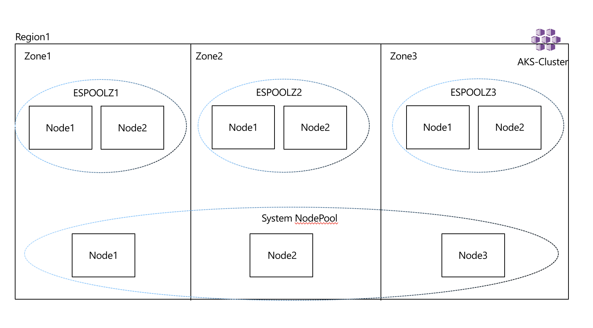
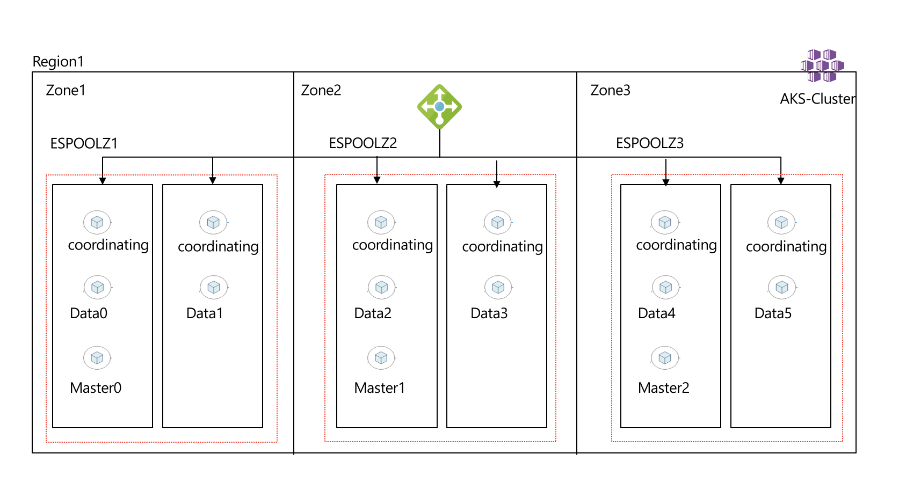

# Introduction

*Slides* can be found (here)[https://github.com/mohmdnofal/aks-best-practices/blob/master/lux_k8s_stateful_workloads/slides/building_resilient_stateful_apps_k8s_100123.pdf] 

*Note* This walkthrough been updated based on the latest work done by my colleague Steve Griffith [here](https://github.com/swgriffith/azure-guides/tree/master/aks-kasten)

We will start by creating a cluster, the cluster will be spun up as below:
1. The cluster will have uptime SLA enabled, to ensure master components are spread across availability zones (AZs)
2. System Node Pool: system node pool has no state in it, as such we will create a single pool with 3 nodes spread across 3 availability zones 
3. User Node Pools: this is where our application will be hosted, we will create 3 node pools with 2 nodes each which will be spread across 3 AZs 
4. Taint user node pools to ensure nothing else land in the pool but our application
5. Auto Scaling will be enabled in each node pool
6. Networking model: Kubenet or CNI don't make a difference here, we will use CNI to ensure max network performance for pods 
7. We will be using ephemeral disks for the nodes operating system 
8. We will be using managed identities 
9. Enable monitoring on the cluster
10. For sake of simplicity we won't be integrating with Azure AD

Here is how the cluster will look like 



# Cluster Create 

```bash
LOCATION=eastus # Location 
AKS_NAME=aks-storage
RG=$AKS_NAME-$LOCATION
AKS_VNET_NAME=$AKS_NAME-vnet # The VNET where AKS will reside
AKS_CLUSTER_NAME=$AKS_NAME-cluster # name of the cluster
AKS_VNET_CIDR=172.16.0.0/16
AKS_NODES_SUBNET_NAME=$AKS_NAME-subnet # the AKS nodes subnet
AKS_NODES_SUBNET_PREFIX=172.16.0.0/23
SERVICE_CIDR=10.0.0.0/16
DNS_IP=10.0.0.10
NETWORK_PLUGIN=azure # use Azure CNI 
SYSTEM_NODE_COUNT=3  # system node pool size (single pool with 3 nodes across AZs)
USER_NODE_COUNT=2 # 3 node pools with 2 nodes each 
NODES_SKU=Standard_D4ds_v5 # node VM type 
K8S_VERSION=$(az aks get-versions  -l $LOCATION --query 'orchestrators[-1].orchestratorVersion' -o tsv)
SYSTEM_POOL_NAME=systempool
STORAGE_POOL_ZONE1_NAME=espoolz1
STORAGE_POOL_ZONE2_NAME=espoolz2
STORAGE_POOL_ZONE3_NAME=espoolz3
IDENTITY_NAME=$AKS_NAME`date +"%d%m%y"`
```

### Create the resource group
```bash
az group create --name $RG --location $LOCATION
```

### create identity for the cluster 
We're going to reuse the cluster identity created below for simplicity, but in a real world scneario you may prefer to maintain separate identities.

```bash
az identity create --name $IDENTITY_NAME --resource-group $RG
```

### get the identity id and clientid, we will use them later 
```bash
IDENTITY_ID=$(az identity show --name $IDENTITY_NAME --resource-group $RG --query id -o tsv)
IDENTITY_CLIENT_ID=$(az identity show --name $IDENTITY_NAME --resource-group $RG --query clientId -o tsv)
```

### Create the VNET and Subnet 
```bash
az network vnet create \
  --name $AKS_VNET_NAME \
  --resource-group $RG \
  --location $LOCATION \
  --address-prefix $AKS_VNET_CIDR \
  --subnet-name $AKS_NODES_SUBNET_NAME \
  --subnet-prefix $AKS_NODES_SUBNET_PREFIX
```

### get the RG, VNET, and Subnet IDs
RG_ID=$(az group show -n $RG  --query id -o tsv)
VNETID=$(az network vnet show -g $RG --name $AKS_VNET_NAME --query id -o tsv)
AKS_VNET_SUBNET_ID=$(az network vnet subnet show --name $AKS_NODES_SUBNET_NAME -g $RG --vnet-name $AKS_VNET_NAME --query "id" -o tsv)

### Assign the managed identity permissions on the RG and VNET
> *NOTE:* For the purposes of this demo we are setting the rights as highly unrestricted. You will want to set the rights below to meet your security needs.
```bash
az role assignment create --assignee $IDENTITY_CLIENT_ID --scope $RG_ID --role Contributor
az role assignment create --assignee $IDENTITY_CLIENT_ID --scope $VNETID --role Contributor
```

### Validate Role Assignment
```bash
az role assignment list --assignee $IDENTITY_CLIENT_ID --all -o table
Principal                             Role         Scope
------------------------------------  -----------  --------------------------------------------------------------------------------------------------------------------------------------------------
82745c38-07de-4068-bd78-XXXXXXXXXXXX  Contributor  /subscriptions/SUBID/resourceGroups/aks-storage-eastus
82745c38-07de-4068-bd78-XXXXXXXXXXXX  Contributor  /subscriptions/SUBID/resourceGroups/aks-storage-eastus/providers/Microsoft.Network/virtualNetworks/aks-storage-vnet
```


### create the cluster 
```bash
az aks create \
-g $RG \
-n $AKS_CLUSTER_NAME \
-l $LOCATION \
--node-count $SYSTEM_NODE_COUNT \
--node-vm-size $NODES_SKU \
--network-plugin $NETWORK_PLUGIN \
--kubernetes-version $K8S_VERSION \
--generate-ssh-keys \
--service-cidr $SERVICE_CIDR \
--dns-service-ip $DNS_IP \
--vnet-subnet-id $AKS_VNET_SUBNET_ID \
--enable-addons monitoring \
--enable-managed-identity \
--assign-identity $IDENTITY_ID \
--nodepool-name $SYSTEM_POOL_NAME \
--uptime-sla \
--zones 1 2 3 
```


### get the credentials 
```bash
az aks get-credentials -n $AKS_CLUSTER_NAME -g $RG

##validate nodes are running and spread across AZs
kubectl get nodes -o wide
NAME                                 STATUS   ROLES   AGE     VERSION   INTERNAL-IP   EXTERNAL-IP   OS-IMAGE             KERNEL-VERSION      CONTAINER-RUNTIME
aks-systempool-40117416-vmss000000   Ready    agent   4m14s   v1.25.4   172.16.0.4    <none>        Ubuntu 22.04.1 LTS   5.15.0-1029-azure   containerd://1.6.4+azure-4
aks-systempool-40117416-vmss000001   Ready    agent   4m13s   v1.25.4   172.16.0.33   <none>        Ubuntu 22.04.1 LTS   5.15.0-1029-azure   containerd://1.6.4+azure-4
aks-systempool-40117416-vmss000002   Ready    agent   4m21s   v1.25.4   172.16.0.62   <none>        Ubuntu 22.04.1 LTS   5.15.0-1029-azure   containerd://1.6.4+azure-4

kubectl describe nodes | grep -i topology.kubernetes.io/zone
                    topology.kubernetes.io/zone=eastus-1
                    topology.kubernetes.io/zone=eastus-2
                    topology.kubernetes.io/zone=eastus-3
```

## Add additional 3 node pools to run elastic search

```bash
##First Node Pool in Zone 1
az aks nodepool add \
--cluster-name $AKS_CLUSTER_NAME \
--mode User \
--name $STORAGE_POOL_ZONE1_NAME \
--node-vm-size $NODES_SKU \
--resource-group $RG \
--zones 1 \
--enable-cluster-autoscaler \
--max-count 4 \
--min-count 2 \
--node-count $USER_NODE_COUNT \
--node-taints app=ealsticsearch:NoSchedule \
--labels dept=dev purpose=storage \
--tags dept=dev costcenter=1000 \
--no-wait

##Second Node Pool in Zone 2
az aks nodepool add \
--cluster-name $AKS_CLUSTER_NAME \
--mode User \
--name $STORAGE_POOL_ZONE2_NAME \
--node-vm-size $NODES_SKU \
--resource-group $RG \
--zones 2 \
--enable-cluster-autoscaler \
--max-count 4 \
--min-count 2 \
--node-count $USER_NODE_COUNT \
--node-taints app=ealsticsearch:NoSchedule \
--labels dept=dev purpose=storage \
--tags dept=dev costcenter=1000 \
--no-wait


##Third Node Pool in Zone 3
az aks nodepool add \
--cluster-name $AKS_CLUSTER_NAME \
--mode User \
--name $STORAGE_POOL_ZONE3_NAME \
--node-vm-size $NODES_SKU \
--resource-group $RG \
--zones 3 \
--enable-cluster-autoscaler \
--max-count 4 \
--min-count 2 \
--node-count $USER_NODE_COUNT \
--node-taints app=ealsticsearch:NoSchedule \
--labels dept=dev purpose=storage \
--tags dept=dev costcenter=1000 \
--no-wait


##it will take couple of minutes to add the nodes, validate that nodes are added to the cluster and spread correctly 
kubectl get nodes -l dept=dev                                      
NAME                               STATUS   ROLES   AGE    VERSION
aks-espoolz1-36926344-vmss000000   Ready    agent   94s    v1.25.4
aks-espoolz1-36926344-vmss000001   Ready    agent   107s   v1.25.4
aks-espoolz2-23233119-vmss000000   Ready    agent   101s   v1.25.4
aks-espoolz2-23233119-vmss000001   Ready    agent   102s   v1.25.4
aks-espoolz3-21517608-vmss000000   Ready    agent   100s   v1.25.4
aks-espoolz3-21517608-vmss000001   Ready    agent   103s   v1.25.4


kubectl describe nodes -l dept=dev | grep -i topology.kubernetes.io/zone

                    topology.kubernetes.io/zone=eastus-1
                    topology.kubernetes.io/zone=eastus-1
                    topology.kubernetes.io/zone=eastus-2
                    topology.kubernetes.io/zone=eastus-2
                    topology.kubernetes.io/zone=eastus-3
                    topology.kubernetes.io/zone=eastus-3

```


# Deploy Elastic Search

## Elastic Search Cluster Setup
Its time to deploy our ElasticSearch Cluster to the Azure Kubernetes Service Cluster we just created. ElasticSearch has 3 main components that make up the cluster Client/Coordinating, Masters, and Data Nodes. you can read more about what each one does in elastic [public docs](https://www.elastic.co/guide/index.html).

1. **Client/Coordinating Nodes** Act as a reverse proxy for the clusters, this is what the external world interacts with. its deployed as a k8s deployment with horizontal pod autoscaling enabled, we will try to have a client in each node to minimize data movement across nodes, we can minimize but we can't prevent it from happening. 
2. **Master Nodes** stores the metadata about the data nodes, it will be deployment as a k8s deployment, ideally we need 3. 
3. **Data Nodes** this is where the magic is, this is where the indices are stored and replicated. this would be our Statefulset with persistent volume to persist the data.

Here is how the cluster will look like



## Elastic Search Cluster Installation 

### Prepare The Cluster 
We start by creating a dedicated storage class for elastic search 

```bash
cat <<EOF | kubectl apply -f -
apiVersion: storage.k8s.io/v1
kind: StorageClass
metadata:
  name: es-storageclass #storage class name
parameters:
  kind: Managed #we will use Azure managed disks
  storageaccounttype: Premium_LRS #use premium managed disk
  tags: costcenter=dev,app=elasticsearch  #add tags so all disks related to our application are tagged
provisioner: disk.csi.azure.com
reclaimPolicy: Retain #changed from default "Delete" to "Retain" so we can retain the disks even if the claim is deleted
volumeBindingMode: WaitForFirstConsumer #instrcuts the scheduler to wait for the pod to be scheduled before binding the dikss
EOF
```

## We will use helm to install the ElasticSearch cluster, we will rely on the ElasticSearch chart provided by bitnami as its the easiest one to navigate. 

## add the bitnami repository
```bash
helm repo add bitnami https://charts.bitnami.com/bitnami
```
## Get the values file we'll need to update 
```shell
helm show values bitnami/elasticsearch > values_sample.yaml
```

We will create our own values file (there is a sample (values.yaml) in this repo you can use) where we will 

1. Adjust the affinity and taints to match our node pools 
2. configure the storage class 
3. optionally make the elastic search service accessible using a load balancer 


## Modifications snippets, the provided values.yaml file is ready with all the changes, the below are just meant as guidance, you can skip to the deployment section 

Modify the storage class in the global parameters so all disks are created from the storage class we already created 

```yaml
global:
  imageRegistry: ""
  ## E.g.
  ## imagePullSecrets:
  ##   - myRegistryKeySecretName
  ##
  imagePullSecrets: []
  storageClass: "es-storageclass"
  elasticsearch:
    service:
      name: elasticsearch
      ports:
        restAPI: 9200
  kibanaEnabled: false
```

Master Nodes to change the number of replicas to 3


#change elastic search service type to LoadBalancer (we will do public for testing purposes only)
```yaml
## Elasticsearch service parameters
##
service:
  ## @param service.type Elasticsearch service type
  ##
  type: LoadBalancer
  ## @param service.ports.restAPI Elasticsearch service REST API port
  ## @param service.ports.transport Elasticsearch service transport port
  ##
  ports:
    restAPI: 9200
    transport: 9300
```

#change number of replicas to 3
```yaml
master:
  ## @param master.masterOnly Deploy the Elasticsearch master-elegible nodes as master-only nodes. Recommended for high-demand deployments.
  ## If you are
  masterOnly: true
  ## @param master.replicaCount Number of master-elegible replicas to deploy
  ##
  replicaCount: 3
  ## @param master.nameOverride String to partially override elasticsearch.master.fullname
  ##
```


#change the affinity rules, here we are adding 2 rules, the first one will instruct the scheduler to spread across 3 AZs and the second one it will give the preference for our nodepools
```yaml
   affinity:
          nodeAffinity:
            requiredDuringSchedulingIgnoredDuringExecution:
              nodeSelectorTerms:
              - matchExpressions:
                - key: topology.kubernetes.io/zone
                  operator: In
                  values:
                  - eastus-1
                  - eastus-2
                  - eastus-3
            requiredDuringSchedulingIgnoredDuringExecution:
              nodeSelectorTerms:
              - matchExpressions:
                - key: agentpool
                  operator: In
                  values:
                  - espoolz1
                  - espoolz2
                  - espoolz3
```

#modify the tolerations, as you might remember we tainted the nodes while we are creating the node pools so we protect them from other workloads 
```yaml
  tolerations:
            - key: "app"
              operator: "Equal"
              value: "elasticsearch"
              effect: "NoSchedule"
```

We will do the same for the rest with the execption that for coordinating and data pods we will have 6 replicase

### ElasticSearch Cluster Deployment

Now that we have configured the charts, we are ready to deploy the ES cluster 
```bash 

```bash
# Create the namespace
kubectl create namespace elasticsearch

# Install elastic search using the values file 
helm install elasticsearch-v1 bitnami/elasticsearch -n elasticsearch --values values.yaml

# Validate the installation, it will take around 5 minutes for all the pods to move to a 'READY' state 
watch kubectl get pods -o wide -n elasticsearch
NAME                              READY   STATUS    RESTARTS   AGE   IP             NODE                               NOMINATED NODE   READINESS GATES
elasticsearch-v1-coordinating-0   1/1     Running   0          27m   172.16.0.118   aks-espoolz3-21517608-vmss000000   <none>           <none>
elasticsearch-v1-coordinating-1   1/1     Running   0          27m   172.16.0.195   aks-espoolz1-36926344-vmss000001   <none>           <none>
elasticsearch-v1-coordinating-2   1/1     Running   0          27m   172.16.0.221   aks-espoolz2-23233119-vmss000000   <none>           <none>
elasticsearch-v1-coordinating-3   1/1     Running   0          27m   172.16.0.144   aks-espoolz3-21517608-vmss000001   <none>           <none>
elasticsearch-v1-coordinating-4   1/1     Running   0          27m   172.16.0.154   aks-espoolz1-36926344-vmss000000   <none>           <none>
elasticsearch-v1-coordinating-5   1/1     Running   0          27m   172.16.0.247   aks-espoolz2-23233119-vmss000001   <none>           <none>
elasticsearch-v1-data-0           1/1     Running   0          27m   172.16.0.151   aks-espoolz1-36926344-vmss000000   <none>           <none>
elasticsearch-v1-data-1           1/1     Running   0          27m   172.16.0.254   aks-espoolz2-23233119-vmss000001   <none>           <none>
elasticsearch-v1-data-2           1/1     Running   0          27m   172.16.0.109   aks-espoolz3-21517608-vmss000000   <none>           <none>
elasticsearch-v1-data-3           1/1     Running   0          27m   172.16.0.228   aks-espoolz2-23233119-vmss000000   <none>           <none>
elasticsearch-v1-data-4           1/1     Running   0          27m   172.16.0.129   aks-espoolz3-21517608-vmss000001   <none>           <none>
elasticsearch-v1-data-5           1/1     Running   0          27m   172.16.0.192   aks-espoolz1-36926344-vmss000001   <none>           <none>
elasticsearch-v1-ingest-0         1/1     Running   0          27m   172.16.0.138   aks-espoolz3-21517608-vmss000001   <none>           <none>
elasticsearch-v1-ingest-1         1/1     Running   0          27m   172.16.0.252   aks-espoolz2-23233119-vmss000001   <none>           <none>
elasticsearch-v1-ingest-2         1/1     Running   0          27m   172.16.0.181   aks-espoolz1-36926344-vmss000001   <none>           <none>
elasticsearch-v1-master-0         1/1     Running   0          27m   172.16.0.218   aks-espoolz2-23233119-vmss000000   <none>           <none>
elasticsearch-v1-master-1         1/1     Running   0          27m   172.16.0.140   aks-espoolz3-21517608-vmss000001   <none>           <none>
elasticsearch-v1-master-2         1/1     Running   0          27m   172.16.0.196   aks-espoolz1-36926344-vmss000001   <none>           <none>


# Check the service so we can access elastic search, note the "External-IP" 
kubectl get svc -n elasticsearch elasticsearch-v1
```

# Lets store the value of the "elasticsearch-v1" service IP so we can use it later
```bash
esip=`kubectl get svc  elasticsearch-v1 -n elasticsearch -o=jsonpath='{.status.loadBalancer.ingress[0].ip}'`
```

Lets validate our deployment and insert some data 
```bash
# Get the version 
curl -XGET "http://$esip:9200"
```
# Sample Output
```yaml
{
  "name" : "elasticsearch-v1-coordinating-4",
  "cluster_name" : "elastic",
  "cluster_uuid" : "I_bLz_ZQSv2KBWNuQBnq8g",
  "version" : {
    "number" : "8.5.3",
    "build_flavor" : "default",
    "build_type" : "tar",
    "build_hash" : "4ed5ee9afac63de92ec98f404ccbed7d3ba9584e",
    "build_date" : "2022-12-05T18:22:22.226119656Z",
    "build_snapshot" : false,
    "lucene_version" : "9.4.2",
    "minimum_wire_compatibility_version" : "7.17.0",
    "minimum_index_compatibility_version" : "7.0.0"
  },
  "tagline" : "You Know, for Search"
}
```

## Check the cluster health and check the shards 
```bash
curl "http://$esip:9200/_cluster/health?pretty"

{
  "cluster_name" : "elastic",
  "status" : "green",
  "timed_out" : false,
  "number_of_nodes" : 18,
  "number_of_data_nodes" : 6,
  "active_primary_shards" : 1,
  "active_shards" : 2,
  "relocating_shards" : 0,
  "initializing_shards" : 0,
  "unassigned_shards" : 0,
  "delayed_unassigned_shards" : 0,
  "number_of_pending_tasks" : 0,
  "number_of_in_flight_fetch" : 0,
  "task_max_waiting_in_queue_millis" : 0,
  "active_shards_percent_as_number" : 100.0
}
```
```bash
# Insert some data and make sure you use 3 shards and a replica 
curl -X PUT "$esip:9200/customer/_doc/1?pretty" -H 'Content-Type: application/json' -d'{
    "name": "test1",
    "settings" : {"index" : {"number_of_shards" : 3, "number_of_replicas" : 1 }}}'

curl -X PUT "$esip:9200/customer/_doc/2?pretty" -H 'Content-Type: application/json' -d'{
    "name": "test2",
    "settings" : {"index" : {"number_of_shards" : 3, "number_of_replicas" : 1 }}}'

# Validate the inserted doc 
curl "$esip:9200/customer/_search?q=*&pretty"

{
  "took" : 83,
  "timed_out" : false,
  "_shards" : {
    "total" : 1,
    "successful" : 1,
    "skipped" : 0,
    "failed" : 0
  },
  "hits" : {
    "total" : {
      "value" : 2,
      "relation" : "eq"
    },
    "max_score" : 1.0,
    "hits" : [
      {
        "_index" : "customer",
        "_id" : "1",
        "_score" : 1.0,
        "_source" : {
          "name" : "test1",
          "settings" : {
            "index" : {
              "number_of_shards" : 3,
              "number_of_replicas" : 1
            }
          }
        }
      },
      {
        "_index" : "customer",
        "_id" : "2",
        "_score" : 1.0,
        "_source" : {
          "name" : "test2",
          "settings" : {
            "index" : {
              "number_of_shards" : 3,
              "number_of_replicas" : 1
            }
          }
        }
      }
    ]
  }
}

# Extra validations 
curl -X GET "$esip:9200/_cat/indices?v"
health status index    uuid                   pri rep docs.count docs.deleted store.size pri.store.size
green  open   customer 7LsHJPcARlOX3zPiEcgDZw   1   1          2            0     20.3kb         10.1kb

# Check the index shards
curl http://$esip:9200/_cat/shards/customer\?pretty\=true
```

# handling Failiures 

At this point you have a working Elastic Search cluster, running on a zone redundant AKS cluster. If you insert several records, and then watch the shards on those records while you delete pods, you should see that AKS will restart those pods and reattach storage, and also that Elastic Search has ensured your data is sharded across nodes, so that application requests will continue to be served as long as an active shard exists.

```shell
#in an adjacent terminal run the below script so we check our indices and shards 
while true; do curl "$esip:9200/customer/_search?q=*&pretty";date;sleep 2; done
#start by deleting some of your master pods and watch Kubernetes recreating the pods and ElasticSearch redistributing the shards 
kubectl delete -n elasticsearch elasticsearch-v1-data-1
kubectl delete -n elasticsearch elasticsearch-v1-data-3

#you can simulate a zone failure by deleting all the pods in a zone or shutting down the nodes 
```

