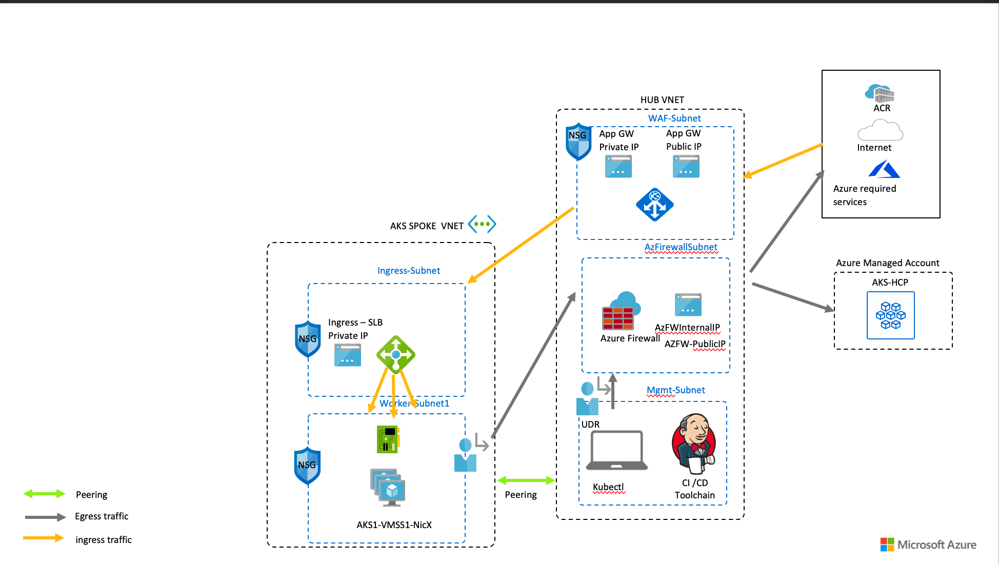
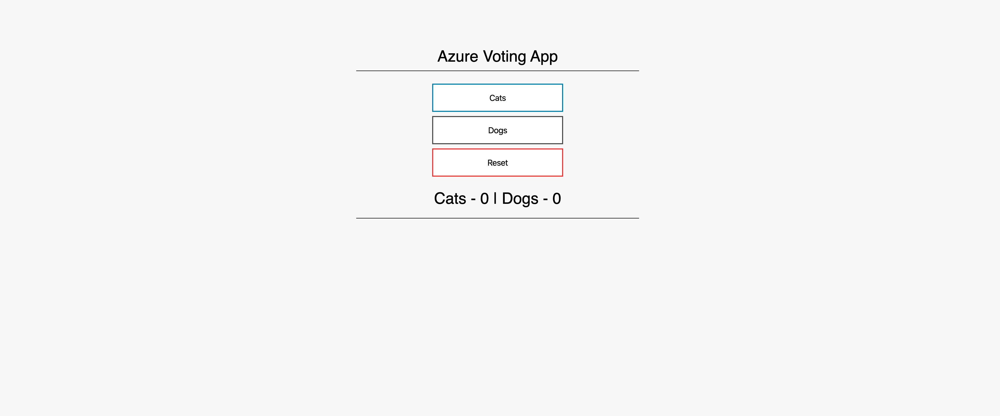

# Azure Kubernetes Service Security Best Practices - Part 2
This section contains the slides, demos, and the recording for the security webinar that was delivered on the 25th of Mar 2020. more work will be added to this section and the repo in general.

## Recording and Slides
Access the recording [here](https://info.microsoft.com/ww-landing-best-practices-to-secure-your-kubernetes-cluster.html) it requires registration.

Download the slides [here](sec_webinar_2_v1.pptx)

## Secure Ingress and Egress Traffic in AKS

Big part of the slides and demo was inspired by the work of my colleagues [Dennis Zielke](https://twitter.com/denzielke), [Jorge Palma](https://twitter.com/jorgefpalma), and [Justin Luk](https://twitter.com/whosjluk)

What we are trying to achieve is to secure both Ingress and Egress traffic in AKS while maintaining full segregations between the traffic types. Ingress traffic flows through a WAF (Azure Application Gateway) in this case, and the egress traffic (originating from the pods) is flowing through a Firewall (Azure Firewall) in this case.

*Note*: if you are interested in AAD Integration, Pod Identity, Ingress, Key Vault, etc.. check part 1 of the webinar located [here](security)


*Illustration of the demo*



1. Lets start by defining our variables 


```shell
RG=webinar
FW_NAME=aks-fw # Firewall Name
LOCATION=eastus # Location 
HUB_VNET_NAME=hub-vnet # The Hub VNET where the Firewall, WAF, and Jump Box would reside
HUB_VNET_CIDR=192.168.0.0/19 
FW_SUBNET_NAME=AzureFirewallSubnet  ####DO NOT CHANGE THE NAME OF THIS SUBNET, this is a requirement for AZ FIREWALL 
FW_SUBNET_PREFIX=192.168.0.0/26
FWROUTE_TABLE_NAME=fw-route # the route table and the route entry to route traffic to the firewall
FWROUTE_NAME=route-all-to-fw

MGMT_SUBNET_NAME=hub-mgmt-subnet  #the subnet where our Jump Box will reside
MGMT_SUBNET_PREFIX=192.168.1.0/24

WAF_SUBNET_NAME=hub-waf-subnet #the subnet where Application Gateway will reside along with the IP and Name
WAF_SUBNET_PREFIX=192.168.2.0/26
APPGW_NAME=hub_appgw
APPGW_PIP_NAME=appgwpip

FW_PUBLIC_IP_NAME=hub-fw-pip #the firewall IP and Config Name
FW_CONFIG_NAME=SECURE_AKS_CONFIG

AKS_VNET_NAME=aks-vnet # The VNET where AKS will reside
AKS_CLUSTER_NAME=k8s-webinar # name of the cluster
AKS_VNET_CIDR=192.168.32.0/19 
AKS_NODES_SUBNET_NAME=aks-default-subnet # the AKS nodes subnet
AKS_NODES_SUBNET_PREFIX=192.168.32.0/23
AKS_INGRESS_SUBNET_NAME=aks-ingress-subnet #the AKS ingress subnet 
AKS_INGRESS_SUBNET_PREFIX=192.168.34.0/27

```

2. Create the resource group and the network setup
   
#create the resource group, vnets, 
```shell
###create RG
$ az group create --name $RG --location $LOCATION

###create the HUB vnet with 3 subnets (FW, MGMT, and WAF)
$ az network vnet create \
  --name $HUB_VNET_NAME \
  --resource-group $RG \
  --location $LOCATION \
  --address-prefix $HUB_VNET_CIDR \
  --subnet-name $FW_SUBNET_NAME \
  --subnet-prefix $FW_SUBNET_PREFIX

$ az network vnet subnet create \
  --name $MGMT_SUBNET_NAME \
  --resource-group $RG \
  --vnet-name $HUB_VNET_NAME   \
  --address-prefix $MGMT_SUBNET_PREFIX


$ az network vnet subnet create \
  --name $WAF_SUBNET_NAME \
  --resource-group $RG \
  --vnet-name $HUB_VNET_NAME   \
  --address-prefix $WAF_SUBNET_PREFIX


###create AKS VNET with 2 subnets (AKS nodes and Ingress)
$ az network vnet create \
  --name $AKS_VNET_NAME \
  --resource-group $RG \
  --location $LOCATION \
  --address-prefix $AKS_VNET_CIDR \
  --subnet-name $AKS_NODES_SUBNET_NAME \
  --subnet-prefix $AKS_NODES_SUBNET_PREFIX


$ az network vnet subnet create \
  --name $AKS_INGRESS_SUBNET_NAME \
  --resource-group $RG \
  --vnet-name $AKS_VNET_NAME   \
  --address-prefix $AKS_INGRESS_SUBNET_PREFIX


######## Peer The Networks ########
$ az network vnet peering create \
 --name peer-hub-to-aks \
 --resource-group $RG \
 --remote-vnet $AKS_VNET_NAME \
 --vnet-name $HUB_VNET_NAME \
 --allow-gateway-transit \
 --allow-vnet-access


 $ az network vnet peering create \
 --name peer-aks-to-hub \
 --resource-group $RG \
 --remote-vnet $HUB_VNET_NAME \
 --vnet-name $AKS_VNET_NAME \
 --allow-vnet-access

```


2. Create the Azure Firewall

#Create the firewall

```shell
### create the firewall
$ az network firewall create \
    --name $FW_NAME \
    --resource-group $RG \
    --location $LOCATION

###create public IP to be attached to the firewall
$ az network public-ip create \
    --name $FW_PUBLIC_IP_NAME \
    --resource-group $RG \
    --location $LOCATION \
    --allocation-method static \
    --sku standard

###get the IP and assign it to a variable
$ FW_PUBLIC_IP=$(az network public-ip show -g $RG -n $FW_PUBLIC_IP_NAME --query "ipAddress" -o tsv)

###assign the IP to the firewall
$ az network firewall ip-config create \
    --firewall-name $FW_NAME \
    --name $FW_CONFIG_NAME \
    --public-ip-address $FW_PUBLIC_IP_NAME \
    --resource-group $RG \
    --vnet-name $HUB_VNET_NAME

###get the firewall private IP so we can create the routes 
$ FW_PRIVATE_IP=$(az network firewall show -g $RG -n $FW_NAME --query "ipConfigurations[0].privateIpAddress" -o tsv)


###create a route table
$ az network route-table create \
    --name $FWROUTE_TABLE_NAME \
    --resource-group $RG \
    --location $LOCATION \
    --disable-bgp-route-propagation true

###create a route entry (Route all to Firewall)
$ az network route-table route create \
  --resource-group $RG \
  --name $FWROUTE_NAME \
  --route-table-name $FWROUTE_TABLE_NAME \
  --address-prefix 0.0.0.0/0 \
  --next-hop-type VirtualAppliance \
  --next-hop-ip-address $FW_PRIVATE_IP


### assign the route to the AKS Nodes Subnet
$ az network vnet subnet update \
    -n $AKS_NODES_SUBNET_NAME \
    -g $RG \
    --vnet-name $AKS_VNET_NAME \
    --address-prefixes $AKS_NODES_SUBNET_PREFIX \
    --route-table $FWROUTE_TABLE_NAME

### assign the route to the Mgmt Subnet
az network vnet subnet update \
    -n $MGMT_SUBNET_NAME \
    -g $RG \
    --vnet-name $HUB_VNET_NAME \
    --address-prefixes $MGMT_SUBNET_PREFIX \
    --route-table $FWROUTE_TABLE_NAME


####create the firewall rules

###create network rule, the rule is very permissive for demo reasons only, this can be restricted to the AKS API server IP/FQDN
$ az network firewall network-rule create \
-g $RG \
-f $FW_NAME \
--collection-name 'aksfwnr' \
-n 'netrules' \
--protocols 'Any' \
--source-addresses '*' \
--destination-addresses '*' \
--destination-ports 22 443 9000 1194 123 \
--action allow --priority 100

### create an application rule to allow the required FQDNs for AKS to function, this obvioulst will be overridden by the network rule, only when you allow 80 and 443 to a specific IP (API Server IP) the below will take affect
###AKS Egress Requirements https://docs.microsoft.com/en-us/azure/aks/limit-egress-traffic
###Azure Firewall rules logic https://docs.microsoft.com/en-us/azure/firewall/rule-processing
az network firewall application-rule create \
-g $RG \
-f $FW_NAME \
--collection-name 'AKS_Global_Required' \
--action allow \
--priority 100 \
-n 'required' \
--source-addresses '*' \
--protocols 'http=80' 'https=443' \
--target-fqdns \
        'aksrepos.azurecr.io' \
        '*blob.core.windows.net' \
        'mcr.microsoft.com' \
        '*cdn.mscr.io' \
        '*.data.mcr.microsoft.com' \
        'management.azure.com' \
        'login.microsoftonline.com' \
        'ntp.ubuntu.com' \
        'packages.microsoft.com' \
        'acs-mirror.azureedge.net' \
        'security.ubuntu.com' \
        'azure.archive.ubuntu.com' \
        'changelogs.ubuntu.com' 

```

3. Deploy Azure Application Gateway

###Deploy Azure Application Gateway
```shell

###create a public IP for the Application Gateway which will act as a WAF
$ az network public-ip create \
  --resource-group $RG \
  --name $APPGW_PIP_NAME \
  --allocation-method Static \
  --sku Standard

### create the Application Gateway, we will create an empty gateway and we will update the backend pool later when we create our first application
### I'm creating a plain HTTP WAF for demo purposes only, in your case this would be TLS

$ az network application-gateway create \
  --name $APPGW_NAME \
  --location $LOCATION \
  --resource-group $RG \
  --vnet-name $HUB_VNET_NAME \
  --subnet $WAF_SUBNET_NAME \
  --capacity 1 \
  --sku WAF_v2 \
  --http-settings-cookie-based-affinity Disabled \
  --frontend-port 80 \
  --http-settings-port 80 \
  --http-settings-protocol Http \
  --public-ip-address $APPGW_PIP_NAME

### update the WAF rules
az network application-gateway waf-config set \
  --enabled true \
  --gateway-name $APPGW_NAME \
  --resource-group $RG \
  --firewall-mode Detection \
  --rule-set-version 3.0

###we leave things here and we carry on with the rest until we have an AKS cluster with a service so we can create the backend pool

```

4. Create the AKS cluster
    

```shell
### first we create the SP that we will use and assign permissions on the VNET
$ az ad sp create-for-rbac -n "webinarsp" --skip-assignment

###save the output from the previous commands into variables 
APPID="XXXXX"
PASSWORD="XXXXX"
### get the vnet ID
VNETID=$(az network vnet show -g $RG --name $AKS_VNET_NAME --query id -o tsv)

# Assign SP Permission to VNET
$ az role assignment create --assignee $APPID --scope $VNETID --role Contributor

# View Role Assignment
$ az role assignment list --assignee $APPID --all -o table

## get the subnet ID of AKS and your Current IP so you can access the cluster 
$ CURRENT_IP=$(dig @resolver1.opendns.com ANY myip.opendns.com +short)
$ AKS_VNET_SUBNET_ID=$(az network vnet subnet show --name $AKS_NODES_SUBNET_NAME -g $RG --vnet-name $AKS_VNET_NAME --query "id" -o tsv)


### create the cluster 
az aks create \
-g $RG \
-n $AKS_CLUSTER_NAME \
-l $LOCATION \
--node-count 2 \
--node-vm-size Standard_B2s \
--network-plugin azure \
--generate-ssh-keys \
--service-cidr 10.0.0.0/16 \
--dns-service-ip 10.0.0.10 \
--docker-bridge-address 172.22.0.1/29 \
--vnet-subnet-id $AKS_VNET_SUBNET_ID \
--load-balancer-sku standard \
--outbound-type userDefinedRouting \
--api-server-authorized-ip-ranges $FW_PUBLIC_IP/32, $CURRENT_IP/32 \
--service-principal $APPID \
--client-secret $PASSWORD 


### get the credentials 
$ az aks get-credentials -n $AKS_CLUSTER_NAME -g $RG

### test
$ kubectl get nodes  
```

5. Create the jump box in the management  subnet so we access the cluster from there too (You can skip this part if you're not interested)

```shell

### Get the ID of MGMT_VNET_SUBNET
$ MGMT_VNET_SUBNET_ID=$(az network vnet subnet show --name $MGMT_SUBNET_NAME -g $RG --vnet-name $HUB_VNET_NAME --query "id" -o tsv)


#####Create the Jump box and create
 az vm create \
-n jumpbox \
-g $RG \
--subnet $MGMT_VNET_SUBNET_ID \
--image UbuntuLTS \
--location $LOCATION \
--size Standard_B1s \
--public-ip-address "" \
--admin-username adminusername \
--ssh-key-values ~/.ssh/id_rsa.pub


### get the IP of your jumpbox
$ JUMPBOX_IP=$(az vm show --show-details  --name jumpbox -g $RG --query "privateIps" -o tsv)


###create a DNAT rule in the firewall to access the jump box, the role is open for sources but you can lock it down obviously

$ az network firewall nat-rule create \
--collection-name jumpbox \
--destination-addresses $FW_PUBLIC_IP \
--destination-ports 22 \
--firewall-name $FW_NAME \
--name inboundrule \
--protocols Any \
--resource-group $RG \
--source-addresses '*' \
--translated-port 22 \
--action Dnat \
--priority 110 \
--translated-address $JUMPBOX_IP

## SSH to the Jump Box
$ ssh adminusername@$FW_PUBLIC_IP -i ~/.ssh/id_rsa


#install the tools in
#install kubectl
sudo apt-get update && sudo apt-get install -y apt-transport-https
echo "deb https://apt.kubernetes.io/ kubernetes-xenial main" | sudo tee -a /etc/apt/sources.list.d/kubernetes.list
sudo apt-get update
sudo apt-get install -y kubectl


#install azure CLI
curl -sL https://aka.ms/InstallAzureCLIDeb | sudo bash

#login to your account
az login 

#get the AKS credintials 
az aks get-credentials -n k8s-webinar -g webinar

#test 
kubectl get nodes 
``` 

6. Create a test application 

Create the service, change the ingress subnet to your ingress subnet name
```yaml
apiVersion: v1
kind: Service
metadata:
  name: internal-app
  annotations:
    service.beta.kubernetes.io/azure-load-balancer-internal: "true"
    service.beta.kubernetes.io/azure-load-balancer-internal-subnet: "aks-ingress-subnet" ###change here
spec:
  type: LoadBalancer
  ports:
  - port: 80
  selector:
    app: internal-app
```

```shell

$ kubectl create -f service_ilb.yaml

###note the External IP to create the backend pool in APP GW
$ kubectl get svc internal-app
NAME           TYPE           CLUSTER-IP     EXTERNAL-IP    PORT(S)        AGE
internal-app   LoadBalancer   10.0.206.249   192.168.34.4   80:30888/TCP   8m47s

### save the IP of the EXTERNAL_IP of the service
$ EXTERNAL_ILB_IP=192.168.34.4

###create the application
$ kubectl create -f example_app.yaml

###make sure pods are running
$ kubectl get pods
NAME                               READY   STATUS    RESTARTS   AGE
azure-vote-back-77dff7bbd5-qpghs   1/1     Running   0          116m
internal-app-68d6845766-wmfkq      1/1     Running   0          116m
```

7. lets configure APP GW and test

```shell
### now we need to update the backend pool of the APP GW with our service EXTERNAL IP
$ az network application-gateway address-pool update \
 --servers $EXTERNAL_ILB_IP \
 --gateway-name $WAF_NAME \
 -g $RG \
 -n appGatewayBackendPool
```

8. All goes well, we can test the setup

```shell
### get the Public IP of the APP GW
$ WAF_PUBLIC_IP=$(az network public-ip show --resource-group $RG --name $APPGW_PIP_NAME --query [ipAddress] --output tsv)

### test using Curl 
$ curl $APPGW_PIP_NAME


<!DOCTYPE html>
<html xmlns="http://www.w3.org/1999/xhtml">
<head>
    <link rel="stylesheet" type="text/css" href="/static/default.css">
    <title>Azure Voting App</title>

    <script language="JavaScript">
        function send(form){
        }
    </script>

</head>
<body>
    <div id="container">
        <form id="form" name="form" action="/"" method="post"><center>
        <div id="logo">Azure Voting App</div>
        <div id="space"></div>
        <div id="form">
        <button name="vote" value="Cats" onclick="send()" class="button button1">Cats</button>
        <button name="vote" value="Dogs" onclick="send()" class="button button2">Dogs</button>
        <button name="vote" value="reset" onclick="send()" class="button button3">Reset</button>
        <div id="space"></div>
        <div id="space"></div>
        <div id="results"> Cats - 0 | Dogs - 0 </div> 
        </form>        
        </div>
    </div>     
</body>
</html>


```

OR Open you browser and go to http://Public.Ip.of.APPGW you should see the below



9. Clean up

```shell
az group delete -g $RG
```