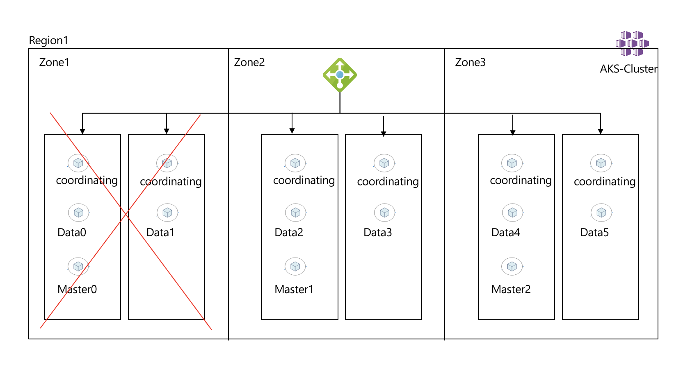

# Handling Failures

So now we have a highly resilient setup, we can see how having the right architecture for both the cluster and the application allow us to tolerate failures.

## Scenario: Handling Zone Failures 

In this simulation, we will take out a full zone from the cluster and see how the application remains in a running state even with losing a full zone, below illustration for what we are going to do



Below video shows how we can do this, follow the instructions underneath if you want to do the same. 

https://user-images.githubusercontent.com/12148324/122196307-6ed88800-ce97-11eb-9da3-d8f89704764f.mov


## Instructions (Simulate a zone failure)

1. Lets insert some data in our "test" index

#insert some data 
```shell
curl -X  POST "http://$esip:9200/test/_doc/" -H 'Content-Type: application/json' -d'
{
"user" : "mo",
"post_date" : "2021-06-13T20:12:12",
"message" : "testing resiliency"
}
'
```
#we should receive the below
```json
{
"user" : "mo",
"post_date" : "2021-06-13T20:12:12",
"message" : "testing resiliency"
}
'
{"_index":"test","_type":"_doc","_id":"TdZAD3oBAp40j8h6zdHs","_version":1,"result":"created","_shards":{"total":2,"successful":2,"failed":0},"_seq_no":0,"_primary_term":1}       
```

#Lets do a quick test to retrieve the data
```shell
curl http://$esip:9200/test/_search?q=user:mo*
```
#we should receive something similar to the below
```json
{"took":706,"timed_out":false,"_shards":{"total":3,"successful":3,"skipped":0,"failed":0},"hits":{"total":{"value":1,"relation":"eq"},"max_score":1.0,"hits":[{"_index":"test","_type":"_doc","_id":"TdZAD3oBAp40j8h6zdHs","_score":1.0,"_source":
{
"user" : "mo",
"post_date" : "2021-06-13T20:12:12",
"message" : "testing resiliency"
}
}]}}
```
#another test that we will use later is to return the http code only
```shell
$ curl -s -o /dev/null -w "%{http_code}" http://$esip:9200/test/_search?q=user:mo*
200
```

2. Run the below script on the side to keep an eye on the application, the script is straightforward just return the status code for our curl call which we used earlier

```shell
while true
do
curl -s -o /dev/null -w "%{http_code}" http://$esip:9200/test/_search\?q\=user:mo\*
echo \\n
done

#you should see something like the below "hopefully"!
200

200

200

200
```

3. On another shell, get the nodes to check on their status, keep it running so we see the nodes changing their status from "Ready" to "Not Ready"
```shell 
kubectl get nodes -w 
NAME                                 STATUS   ROLES   AGE    VERSION
aks-espoolz1-37272235-vmss000000     Ready    agent   3d7h   v1.21.1
aks-espoolz1-37272235-vmss000001     Ready    agent   3d7h   v1.21.1
aks-espoolz2-37272235-vmss000000     Ready    agent   3d7h   v1.21.1
aks-espoolz2-37272235-vmss000001     Ready    agent   3d7h   v1.21.1
aks-espoolz3-37272235-vmss000000     Ready    agent   3d7h   v1.21.1
aks-espoolz3-37272235-vmss000001     Ready    agent   3d7h   v1.21.1
aks-systempool-37272235-vmss000000   Ready    agent   3d7h   v1.21.1
aks-systempool-37272235-vmss000001   Ready    agent   3d7h   v1.21.1
aks-systempool-37272235-vmss000002   Ready    agent   3d7h   v1.21.1
```

4. Now SSH into your nodes and stop the Kubelet, there are many ways to SSH into your nodes like using a bastion/jump host which you should do, but for sake of simplicity we I'll use [kubectl-node_shell](https://github.com/kvaps/kubectl-node-shell).

Note: If you use "kubectl-node_shell) to open a shell into the nodes, then once you stop the kubelet you will be logged out which is expected, don't panic leave it as is for 5-6 minutes and then the AKS diagnostics agent will restart the kubelet for you. 

```shell 
#We will take out the nodes in Zone1 
$ kubectl-node_shell aks-espoolz1-37272235-vmss000000
#once inside the node run the below
systemctl stop kubelet

#do the same for the other node 
$ kubectl-node_shell aks-espoolz1-37272235-vmss000001
$ systemctl stop kubelet

#by now you should be logged out of the nodes, but notice that your application is still running
```


# Summary
We have simulated a full zone failure and demonstrated how our application remained in a running status, this is the power of having the right architecture for your clusters and application. 

Please continue to next section [Handling CLuster Upgrades](handling_upgrades.md).


