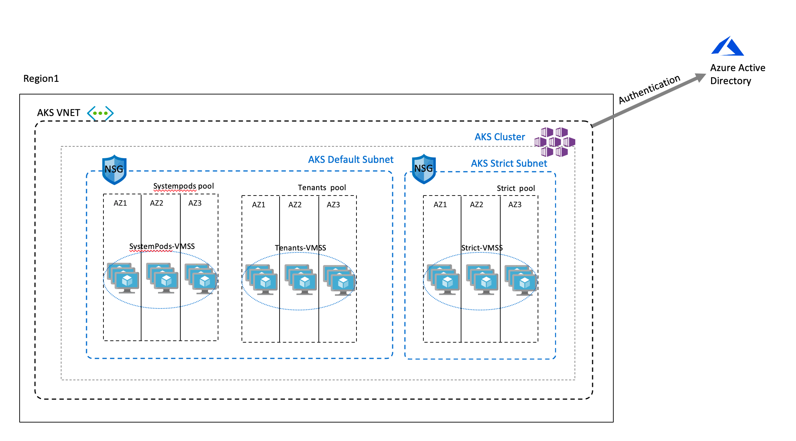

# Tenancy and Scheduling in Azure Kubernetes Service

For old tenancy and scheduling slides download [here](01.Tenancy.pptx) and the recording can be access [here](https://www.youtube.com/watch?v=966TJ6mlOYY&t=6s)

For partners tenancy and high availability session slides download [here](tenancy_ha_slides.pptx)

## Multi Tenant - Shared Cluster Demo Summery

- A cluster with 3 node pools 
1. System Pods Pool in the default subnet 
2. Shared Tenants Pool in the default subnet 
3. Strict Pool for special applications in a special applications subnet 

- The cluster will be integrated with Azure Active Directory for Authentication using the new V2 experience 
https://docs.microsoft.com/en-gb/azure/aks/azure-ad-v2



- The workloads 

1. We will create a namespace called tenant1 
2. There are 2 type of users for this namespaces (Name Space Admin and Developer)
3. All pods in this namespace will reside in the shared tenant pool 
4. The namespace will have its own resource limits 
5. The namespace will have its own default network policy 
6. The namespace will have its own ingress controller 

## Multi Tenant - Shared Cluster Demo

1. Some of the feature i'll be using are in preview so you need to have the preview extension installed or updated 

```shell
# Install the aks-preview extension
$ az extension add --name aks-preview

# Update the extension to make sure you have the latest version installed
$ az extension update --name aks-preview

##Register the AADv2 
$ az feature register --name AAD-V2 --namespace Microsoft.ContainerService
$ az feature list -o table --query "[?contains(name, 'Microsoft.ContainerService/AAD-V2')].{Name:name,State:properties.state}"
$ az provider register --namespace Microsoft.ContainerService
```

2. Create the variables for the demo 

```shell
RG=aks-demos ## the resource group
LOCATION=eastus ## the region 
AKS_VNET_NAME=aks-vnet ## the name of the VNET, we will be using CNI for this setup, Kubenet can be used too
AKS_CLUSTER_NAME=k8s-tenancy ## cluster name 
AKS_VNET_CIDR=192.168.32.0/19 ## the VNET CIDR 
AKS_NODES_SUBNET_NAME=aks-default-subnet ## The default subnet name
AKS_NODES_SUBNET_PREFIX=192.168.32.0/23 ## The default subnet IP space 
AKS_SPECIAL_APP_SUBNET_NAME=aks-special-app-subnet ## A subnet for special applications with strict isolation requirements 
AKS_SPECIAL_APP_SUBNET_PREFIX=192.168.35.0/24 ## special apps subnet IP space 
AAD_ADMIN_GROUP_ID=XXXXX-XXXX-XXXX-XXXX-XXXXX4ab04ab0 ## The AAD Group ID for the admins, follow instructions here https://docs.microsoft.com/en-gb/azure/active-directory/fundamentals/active-directory-groups-create-azure-portal
AAD_NAMESPACE_ADMIN_GROUP_ID=XXXXX-XXXX-XXXX-XXXX-XXXXX130b   ## The AAD Group ID for the Namespace admin 
TENANT_ID=XXXXX-XXXX-XXXX-XXXX-XXXXXXXXXX ## Your AAD Tenant ID
```

3. Create the resource group, the virtual nettwork and the subnets 

```shell

#create the resource group
$ az group create --name $RG --location $LOCATION

#create AKS VNET with the default subnet
$ az network vnet create \
  --name $AKS_VNET_NAME \
  --resource-group $RG \
  --location $LOCATION \
  --address-prefix $AKS_VNET_CIDR \
  --subnet-name $AKS_NODES_SUBNET_NAME \
  --subnet-prefix $AKS_NODES_SUBNET_PREFIX

#create a subnet for the the applications with strict isolation requirements
$ az network vnet subnet create \
  --name $AKS_SPECIAL_APP_SUBNET_NAME \
  --resource-group $RG \
  --vnet-name $AKS_VNET_NAME   \
  --address-prefix $AKS_SPECIAL_APP_SUBNET_PREFIX


#store the IDs for both subnets 
$ AKS_VNET_SUBNET_ID=$(az network vnet subnet show --name $AKS_NODES_SUBNET_NAME -g $RG --vnet-name $AKS_VNET_NAME --query "id" -o tsv)
$ AKS_SPECIAL_APP_SUBNET_ID=$(az network vnet subnet show --name $AKS_SPECIAL_APP_SUBNET_NAME -g $RG --vnet-name $AKS_VNET_NAME --query "id" -o tsv)

```


4. Create the AKS cluster along with its node pools, then secure the access to the API server

```shell

# create the AKS cluster in multi zone, integrated with AAD using V2 experience. 
$ az aks create \
-g $RG \
-n $AKS_CLUSTER_NAME \
-l $LOCATION \
--zones 1 2 3 \
--nodepool-name defaultnp \
--enable-cluster-autoscaler \
--max-count 10 \
--min-count 2 \
--node-count 2 \
--node-vm-size Standard_B2s \
--network-plugin azure \
--generate-ssh-keys \
--service-cidr 10.0.0.0/16 \
--dns-service-ip 10.0.0.10 \
--docker-bridge-address 172.22.0.1/29 \
--vnet-subnet-id $AKS_VNET_SUBNET_ID \
--load-balancer-sku standard \
--enable-aad \
--aad-admin-group-object-ids $AAD_ADMIN_GROUP_ID \
--aad-tenant-id $TENANT_ID


# Add a node pool which will be dedicated for system resources (kube-system pods)
# CLI doesn't yet support adding nodepool taints at AKS provisioning time, this can be done using ARM templates.follow up on the issue here https://github.com/Azure/AKS/issues/1402
# Note the "--mode System" this is a new feature from AKS which will add affinity to system pods to always land in the (System Pool(s))
# Note the Taint (CriticalAddonsOnly=yes:NoExecute), AKS system pods come with a toleration for this taint by default 

$ az aks nodepool add \
--cluster-name $AKS_CLUSTER_NAME \
--resource-group $RG \
--zones 1 2 3 \
--name systempods \
--labels use=systempods \
--node-taint CriticalAddonsOnly=yes:NoExecute \
--mode System \
--enable-cluster-autoscaler \
--node-count 2 \
--max-count 10 \
--min-count 2 \
--node-vm-size Standard_B2s 

# add another node pool which will be shared between tenants 
# this will instruct AKS that this pool is dedicated to pods which don't belong to Kube-system 

$ az aks nodepool add \
--cluster-name $AKS_CLUSTER_NAME \
--resource-group $RG \
--name tenantspool \
--zones 1 2 3 \
--labels use=tenants \
--mode User \
--enable-cluster-autoscaler \
--node-count 2 \
--max-count 10 \
--min-count 2 \
--node-vm-size Standard_B2s 


# add another node pool in a different subnet which will be dedicated for workload with strict isolation requirements 

$ az aks nodepool add \
--cluster-name $AKS_CLUSTER_NAME \
--resource-group $RG \
--name strictpool \
--zones 1 2 3 \
--labels use=regulated-workloads \
--node-taint workload=regulated:NoExecute \
--mode User \
--enable-cluster-autoscaler \
--node-count 1 \
--max-count 10 \
--min-count 1 \
--node-vm-size Standard_B2s \
--vnet-subnet-id $AKS_SPECIAL_APP_SUBNET_ID

# now delete the default node pool, this step is only require as CLI doesn't support adding taints during cluster provisioning time YET!
$ az aks nodepool delete \
--cluster-name $AKS_CLUSTER_NAME \
--resource-group $RG \
--name defaultnp

# list the pools 
$ az aks nodepool list \
--cluster-name $AKS_CLUSTER_NAME \
--resource-group $RG \
-o table

Name         OsType    VmSize        Count    MaxPods    ProvisioningState    Mode
-----------  --------  ------------  -------  ---------  -------------------  ------
strictpool   Linux     Standard_B2s  1        30         Succeeded            User
systempods   Linux     Standard_B2s  2        30         Succeeded            System
tenantspool  Linux     Standard_B2s  2        30         Succeeded            User

# Secure the access to the API server using your office CIDR 
$ OFFICE_IP_CIDR=W.X.Y.Z/S 
$ az aks update -g $RG -n $AKS_NAME --api-server-authorized-ip-ranges $OFFICE_IP_CIDR

```

5. Verify the integration with AAD, the pools, labels, and taints. 

```shell
# get the  credentials, your user should already be part of the cluster admin group 
$ az aks get-credentials -n $AKS_CLUSTER_NAME -g $RG

# test and validate 
$ kubectl get nodes 
To sign in, use a web browser to open the page https://microsoft.com/devicelogin and enter the code XXXXXXXXX to authenticate.

NAME                                  STATUS   ROLES   AGE     VERSION
aks-strictpool-28582535-vmss000000    Ready    agent   82m     v1.15.10
aks-systempods-28582535-vmss000000    Ready    agent   89m     v1.15.10
aks-systempods-28582535-vmss000001    Ready    agent   88m     v1.15.10
aks-tenantspool-28582535-vmss000000   Ready    agent   4d23h   v1.15.10
aks-tenantspool-28582535-vmss000001   Ready    agent   4d23h   v1.15.10


# verify the existing binding for the Cluster Admin group

$ kubectl get clusterrolebindings.rbac.authorization.k8s.io aks-cluster-admin-binding-aad -o yaml

apiVersion: rbac.authorization.k8s.io/v1
kind: ClusterRoleBinding
metadata:
  name: aks-cluster-admin-binding-aad
roleRef:
  apiGroup: rbac.authorization.k8s.io
  kind: ClusterRole
  name: cluster-admin
subjects:
- apiGroup: rbac.authorization.k8s.io
  kind: Group
  name: XXXXX-XXXX-XXXX-XXXX-XXXXX4ab0


# the group name should match our AAD_ADMIN_GROUP_ID

$ echo $AAD_ADMIN_GROUP_ID
XXXXX-XXXX-XXXX-XXXX-XXXXX4ab0


# Now verify the pools 

# show the lables 
$ kubectl get nodes --show-labels
NAME                                  STATUS   ROLES   AGE     VERSION    LABELS
aks-strictpool-28582535-vmss000000    Ready    agent   4h9m    v1.15.10   agentpool=strictpool,...,failure-domain.beta.kubernetes.io/zone=0,...,use=regulated-workloads
aks-systempods-28582535-vmss000000    Ready    agent   4h15m   v1.15.10   agentpool=systempods,...,failure-domain.beta.kubernetes.io/zone=0,...,use=systempods
aks-systempods-28582535-vmss000001    Ready    agent   4h15m   v1.15.10   agentpool=systempods,...,failure-domain.beta.kubernetes.io/zone=1,...,use=systempods
aks-tenantspool-28582535-vmss000000   Ready    agent   5d1h    v1.15.10   agentpool=tenantspool,...,failure-domain.beta.kubernetes.io/zone=0,...,use=tenants
aks-tenantspool-28582535-vmss000001   Ready    agent   5d1h    v1.15.10   agentpool=tenantspool,...,failure-domain.beta.kubernetes.io/zone=1,...,use=tenants

# Verify the taints exist for the system and strict pools 
$ kubectl describe nodes -l agentpool=systempods | grep -i taints
Taints:             CriticalAddonsOnly=yes:NoExecute
Taints:             CriticalAddonsOnly=yes:NoExecute

$ kubectl describe nodes -l agentpool=strictpool | grep -i taints
Taints:             workload=regulated:NoExecute

```

6. Now lets create a namespace and add proper isolation controls on it 

```shell
# create the "Tenant1" namesapce  
$ kubectl create namespace tenant1

# create the roles for the namespace admin 
$ cat <<EOF >tenant1_admin_rbac_role.yaml
kind: Role
apiVersion: rbac.authorization.k8s.io/v1beta1
metadata:
  name: tenant1-ns-admin-role
  namespace: tenant1
rules:
- apiGroups: ["", "extensions", "apps"]
  resources: ["*"]
  verbs: ["*"]
- apiGroups: ["batch"]
  resources:
  - jobs
  - cronjobs
  verbs: ["*"]
EOF

$ kubectl create -f tenant1_admin_rbac_role.yaml 

#change the group ID of the tenant1 admin
$ cat <<EOF >tenant1_admin_rolebinding.yaml
kind: RoleBinding
apiVersion: rbac.authorization.k8s.io/v1beta1
metadata:
  name: tenant1-ns-admin-rolebinding
  namespace: tenant1
roleRef:
  apiGroup: rbac.authorization.k8s.io
  kind: Role
  name: tenant1-ns-admin-role
subjects:
- kind: Group
  namespace: tenant1
  name: #PLCAEHOLDER FOR THE TENANT1 NAMESPACE ADMIN GROUP ID
EOF

$ kubectl create -f tenant1_admin_rolebinding.yaml

# repeat the same for the namespace developer with the desired permissions 


# apply resource quotas to the namespace 
$ cat <<EOF >tenant1_namespace_resource_quotas.yaml
apiVersion: v1
kind: ResourceQuota
metadata:
  name: tenant1-compute-resources-limits
spec:
  hard:
    requests.cpu: "3"
    requests.memory: 3000M
    limits.cpu: "3"
    limits.memory: 3000M
EOF

$ kubectl apply -f tenant1_namespace_resource_quotas.yaml --namespace=tenant1

#apply pod limit range, so pods which don't claim resource quotas are capped by default
$ cat <<EOF >tenant1_namespace_limit_range.yaml
apiVersion: v1
kind: LimitRange
metadata:
  name: tenant1-namespace-limit-range
spec:
  limits:
  - default:
      memory: 150M
      cpu: 0.1
    defaultRequest:
      memory: 150M
      cpu: 0.1
    type: Container
EOF

$ kubectl apply -f tenant1_namespace_limit_range.yaml --namespace=tenant1

# describe the namespace 
$ kubectl describe namespace tenant1
Name:         tenant1
Labels:       <none>
Annotations:  <none>
Status:       Active

Resource Quotas
 Name:            tenant1-compute-resources-limits
 Resource         Used  Hard
 --------         ---   ---
 limits.cpu       200m  3
 limits.memory    300M  3G
 requests.cpu     200m  3
 requests.memory  300M  3G

Resource Limits
 Type       Resource  Min  Max  Default Request  Default Limit  Max Limit/Request Ratio
 ----       --------  ---  ---  ---------------  -------------  -----------------------
 Container  cpu       -    -    100m             100m           -
 Container  memory    -    -    150M             150M           -


# create an ingress controller in this namespace (the below example is using HELM3)
$ helm install tenant1-ingress \
stable/nginx-ingress \
--namespace=tenant1 \
--set rbac.create=true \
--set controller.scope.namespace=tenant1 \
--set controller.service.externalTrafficPolicy=Local \
--set controller.service.type=LoadBalancer

# verify the ingress got installed 
$ kubectl get all -n tenant1
NAME                                                                 READY   STATUS    RESTARTS   AGE
pod/nginx                                                            1/1     Running   0          4d21h
pod/tenant1-ingress-nginx-ingress-controller-68f84d57c-cssts         1/1     Running   0          4d12h
pod/tenant1-ingress-nginx-ingress-default-backend-79f98cf49f-t2nvh   1/1     Running   0          4d12h

NAME                                                    TYPE           CLUSTER-IP     EXTERNAL-IP      PORT(S)                      AGE
service/tenant1-ingress-nginx-ingress-controller        LoadBalancer   10.0.170.70    X.X.X.X   80:30679/TCP,443:31901/TCP   4d12h
service/tenant1-ingress-nginx-ingress-default-backend   ClusterIP      10.0.247.105   <none>           80/TCP                       4d12h

NAME                                                            READY   UP-TO-DATE   AVAILABLE   AGE
deployment.apps/tenant1-ingress-nginx-ingress-controller        1/1     1            1           4d12h
deployment.apps/tenant1-ingress-nginx-ingress-default-backend   1/1     1            1           4d12h

NAME                                                                       DESIRED   CURRENT   READY   AGE
replicaset.apps/tenant1-ingress-nginx-ingress-controller-68f84d57c         1         1         1       4d12h
replicaset.apps/tenant1-ingress-nginx-ingress-default-backend-79f98cf49f   1         1         1       4d12h


#create a default network policy for this namespace (we will allow ingress 80,443 and egress on 53 only)
$ cat <<EOF >tenant1_network_policy.yaml
apiVersion: networking.k8s.io/v1
kind: NetworkPolicy
metadata:
  name: tenant1-network-policy
  namespace: tenant1
spec:
  podSelector:
    matchLabels: {}
  policyTypes:
  - Egress
  - Ingress
  egress:
    - ports:
      - port: 53
        protocol: UDP
      - port: 53
        protocol: TCP
      to: []
  ingress:
    - ports:
      - port: 80
        protocol: TCP
      - port: 443
        protocol: TCP
      from: []
EOF

$ kubectl create -f tenant1_network_policy.yaml

#You can apply security context and/or use Gatekeeperv3 to apply general policies to the cluster 

```

7. Lets tets with a small application 

```shell
# Create an ngnix deployment
$ kubectl create deployment nginx --image=nginx --namespace=tenant1
deployment.apps/nginx created

# Scale the deployment
$ kubectl scale deployment nginx --replicas=6 --namespace=tenant1
deployment.extensions/nginx scaled

# Verify where the pods landed 
$ kubectl get pods -n tenant1 -o wide
NAME                                                             READY   STATUS    RESTARTS   AGE     IP               NODE                                  NOMINATED NODE   READINESS GATES
nginx                                                            1/1     Running   0          4d23h   192.168.32.72    aks-tenantspool-28582535-vmss000000   <none>           <none>
nginx-554b9c67f9-672qm                                           1/1     Running   0          37s     192.168.32.86    aks-tenantspool-28582535-vmss000000   <none>           <none>
nginx-554b9c67f9-bk8dq                                           1/1     Running   0          37s     192.168.32.95    aks-tenantspool-28582535-vmss000000   <none>           <none>
nginx-554b9c67f9-bt559                                           1/1     Running   0          37s     192.168.32.110   aks-tenantspool-28582535-vmss000001   <none>           <none>
nginx-554b9c67f9-l28dt                                           1/1     Running   0          37s     192.168.32.117   aks-tenantspool-28582535-vmss000001   <none>           <none>
nginx-554b9c67f9-t6qq6                                           1/1     Running   0          104s    192.168.32.96    aks-tenantspool-28582535-vmss000000   <none>           <none>
nginx-554b9c67f9-xpv7h                                           1/1     Running   0          37s     192.168.32.114   aks-tenantspool-28582535-vmss000001   <none>           <none>
tenant1-ingress-nginx-ingress-controller-68f84d57c-cssts         1/1     Running   0          4d14h   192.168.32.102   aks-tenantspool-28582535-vmss000001   <none>           <none>
tenant1-ingress-nginx-ingress-default-backend-79f98cf49f-t2nvh   1/1     Running   0          4d14h   192.168.32.106   aks-tenantspool-28582535-vmss000001   <none>           <none>

# check the limit range has been applied
$ kubectl describe pod nginx-554b9c67f9-672qm -n tenant1
Name:           nginx-554b9c67f9-672qm
Namespace:      tenant1
Priority:       0
Node:           aks-tenantspool-28582535-vmss000000/192.168.32.66
Start Time:     Wed, 15 Apr 2020 16:27:59 +0200
Labels:         app=nginx
                pod-template-hash=554b9c67f9
Annotations:    kubernetes.io/limit-ranger: LimitRanger plugin set: cpu, memory request for container nginx; cpu, memory limit for container nginx
Status:         Running
IP:             192.168.32.86
IPs:            <none>
Controlled By:  ReplicaSet/nginx-554b9c67f9
Containers:
  nginx:
    Container ID:   docker://6487f6fe62066b6e908bc7e58932d858e570393ed8f8adbc9318d06ac8d25a97
    Image:          nginx
    Image ID:       docker-pullable://nginx@sha256:282530fcb7cd19f3848c7b611043f82ae4be3781cb00105a1d593d7e6286b596
    Port:           <none>
    Host Port:      <none>
    State:          Running
      Started:      Wed, 15 Apr 2020 16:28:01 +0200
    Ready:          True
    Restart Count:  0
    Limits:
      cpu:     100m
      memory:  150M
    Requests:
      cpu:        100m
      memory:     150M
    Environment:  <none>
....

```